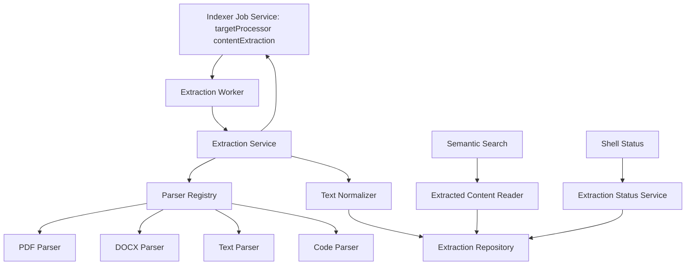
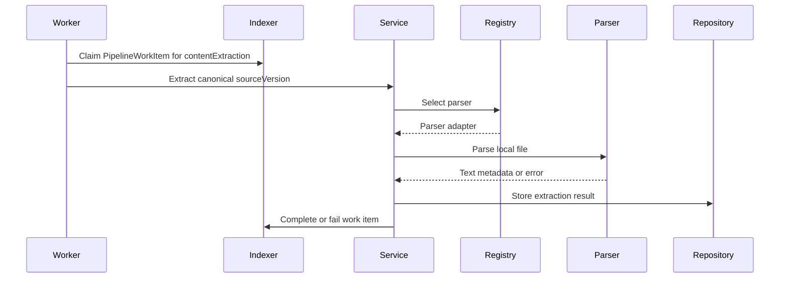
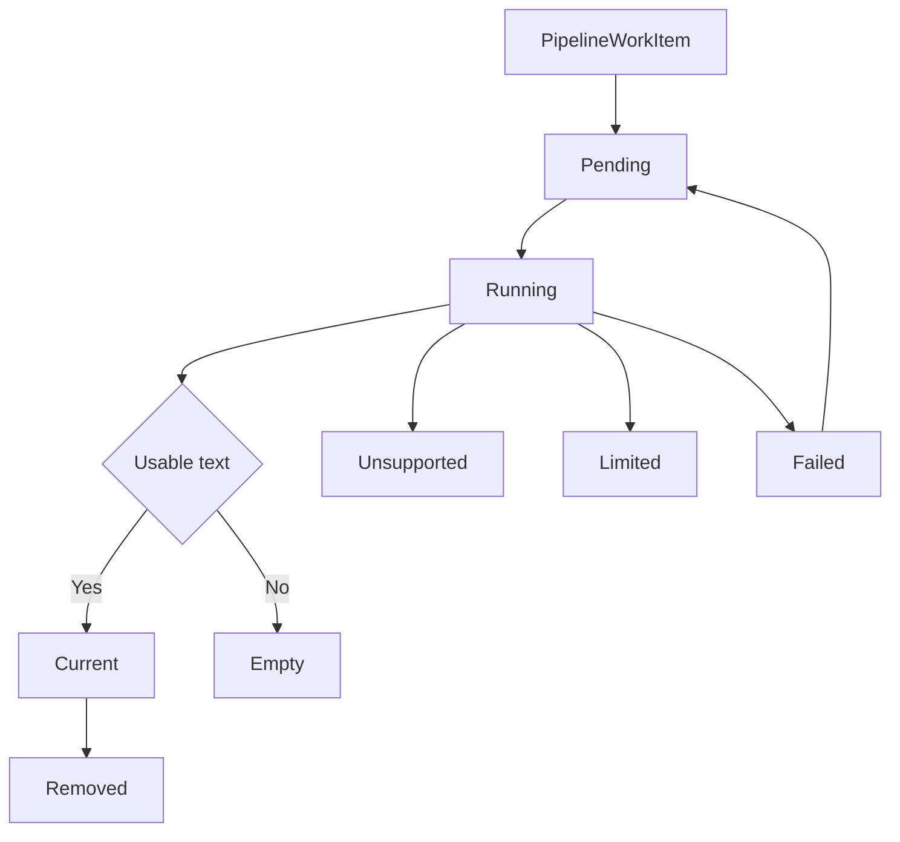
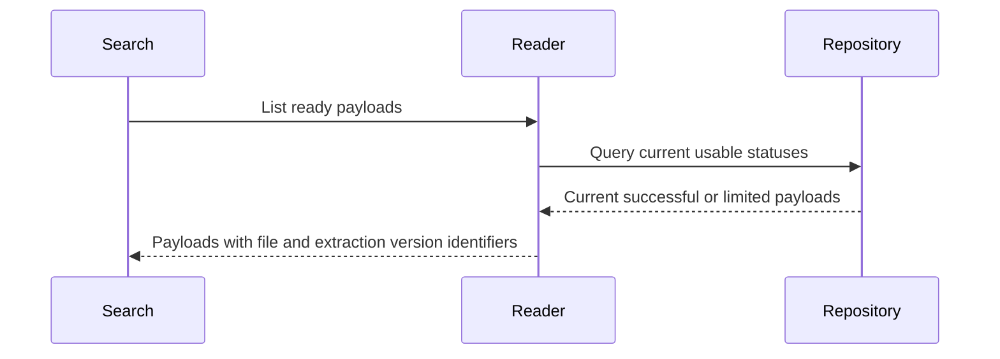
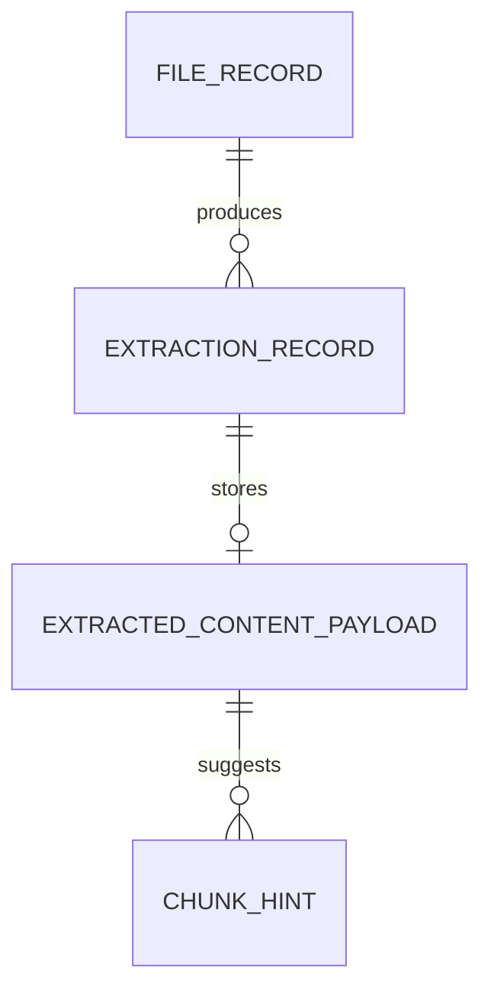

# Design Document

## Overview

This feature delivers local text and metadata extraction for indexed Windows files so future semantic search can understand document contents rather than only paths and filenames. It changes the current system by adding a content extraction worker, parser adapters for common text-bearing formats, normalized extracted-content records, and status contracts tied to the Local File Indexer `PipelineWorkItem` lifecycle.

The pipeline is local-first and contract-first. It consumes stable `FileRecord` references, canonical `sourceVersion`, and durable `PipelineWorkItem` records with `targetProcessor = "contentExtraction"` from `local-file-indexer`, selects a parser by canonical `fileType` and normalized `extension`, normalizes parser output into one payload shape, and exposes only current usable payloads to future semantic intake.

### Goals

- Extract useful text and basic metadata from PDF, DOCX, plain text, Markdown, note, and code files.
- Persist normalized extraction payloads, statuses, version markers, errors, and chunking hints.
- Keep extraction recoverable, incremental, and safe for local background operation.
- Provide downstream consumers one parser-neutral content interface.

### Non-Goals

- OCR for scanned PDFs or images.
- Image captioning, visual understanding, embedding generation, vector storage, retrieval, ranking, or result explanation.
- File discovery, file watching, folder registration, or desktop UI implementation.
- Remote document processing or cloud ingestion.

## Boundary Commitments

### This Spec Owns

- Claiming and settling Local File Indexer `PipelineWorkItem` records where `targetProcessor = "contentExtraction"`.
- Parser selection for supported text-bearing local formats.
- Parser adapters for PDF, DOCX, text, Markdown or notes, and code files.
- Normalized extracted-content payloads, extraction status, errors, version markers, and chunking hints.
- Read interfaces that expose current extracted content and ready-for-embedding payloads.

### Out of Boundary

- File identity, root scope, eligibility filtering, file freshness, crawl, watch, and removal work item creation owned by Local File Indexer.
- OCR and image captioning owned by Vision OCR Pipeline.
- Embeddings, vector persistence, retrieval ranking, and result explanation owned by Semantic Vector Search.
- Desktop presentation and file open or reveal actions owned by Desktop Search Shell.
- Provider policy UI, remote processing modes, and resource-control settings owned by Privacy Performance Controls.

### Allowed Dependencies

- Local File Indexer `FileRecord`, canonical `sourceVersion`, and `JobService` contracts for `PipelineWorkItem` intake, file metadata, and completion or failure reporting.
- Local embedded persistence for extraction records, payloads, parser diagnostics, and current pointers.
- Local parser libraries or platform adapters for supported document formats.
- Desktop Search Shell only through aggregate status data; no direct UI ownership.

### Revalidation Triggers

- Changes to `FileRecord`, canonical `sourceVersion`, `PipelineWorkItem`, `targetProcessor`, work item completion semantics, or file version marker shape.
- Changes to `ExtractedContentPayload`, `ExtractionRecord`, status values, or ready-for-embedding query semantics.
- Addition of OCR, remote parsing, embedding generation, or vector storage inside extraction.
- Changes to local storage migration, parser runtime prerequisites, concurrency limits, or default local-only processing.

## Architecture

### Existing Architecture Analysis

The repository currently contains Kiro specifications but no implemented extraction code. The Local File Indexer design establishes the upstream contract: stable file records, canonical file metadata, canonical `sourceVersion`, durable `PipelineWorkItem` records derived from `FileChangeEvent`, and retryable work item status. The Desktop Search Shell design establishes that user-facing status must be high-level and not expose extraction, OCR, embedding, or vector internals.

### Architecture Pattern & Boundary Map

**Architecture Integration**:
- Selected pattern: Local worker pipeline with ports for indexer work items, parser adapters, persistence, and downstream content reads.
- Dependency direction: Types and config -> parser adapters -> normalization -> repositories -> extraction service -> worker and downstream adapters.
- Existing patterns preserved: local-first Windows MVP, staged roadmap boundaries, strong TypeScript contracts, and background work that does not block the shell.
- New components rationale: Parser adapters isolate file-format concerns; the normalizer creates a single payload shape; the repository preserves current and historical extraction state; the worker connects extraction to durable indexer work items.



### Technology Stack

| Layer | Choice / Version | Role in Feature | Notes |
|-------|------------------|-----------------|-------|
| Desktop runtime | Tauri 2 | Hosts local background extraction in the desktop app process | Aligns with existing shell direction |
| Application language | TypeScript 5 with Rust only for native file access if needed | Shared contracts, parser orchestration, local services | Public contracts must not use `any` |
| Parsing | Local parser adapters | Extract text and metadata from supported formats | Specific libraries selected during implementation by compatibility |
| Data / Storage | Local embedded database adapter | Persists extraction records, payloads, statuses, and current pointers | Must support transactional updates |
| Work items | Local indexer `PipelineWorkItem` lifecycle | Provides intake and independent settlement for extraction work | No separate external queue for MVP |

## File Structure Plan

### Directory Structure

```text
src/
├── extraction/
│   ├── types.ts                         # Extraction status, payload, parser result, error, and reader contracts
│   ├── extractionConfig.ts              # Local limits, supported extensions, parser mapping, and concurrency settings
│   ├── parserRegistry.ts                # Selects parser adapter from file metadata and content type
│   ├── extractionService.ts             # Coordinates parser selection, normalization, persistence, and job settlement
│   ├── extractionWorker.ts              # Claims contentExtraction work items and runs extraction within concurrency limits
│   ├── extractionStatusService.ts       # Builds aggregate and per-file extraction status snapshots
│   ├── extractedContentReader.ts        # Downstream read interface for current payloads and ready-for-embedding lists
│   ├── normalization/
│   │   ├── textNormalizer.ts            # Cleans parser text while preserving meaningful text and code boundaries
│   │   └── chunkHintBuilder.ts          # Creates parser-neutral chunking hints
│   ├── parsers/
│   │   ├── contentParser.ts             # Parser adapter interface and shared parser error envelope
│   │   ├── pdfParser.ts                 # PDF text and metadata extraction adapter
│   │   ├── docxParser.ts                # DOCX text and metadata extraction adapter
│   │   ├── textParser.ts                # Plain text, Markdown, and note extraction adapter
│   │   └── codeParser.ts                # Source code text extraction adapter
│   ├── repositories/
│   │   └── extractionRepository.ts      # Persistence contract for extraction records and current payloads
│   └── storage/
│       ├── extractionSchema.ts          # Schema and migration definitions for extracted content
│       └── localExtractionStore.ts      # Transactional embedded-store adapter
tests/
└── content-extraction-pipeline/
    ├── parser-registry.test.ts
    ├── text-normalizer.test.ts
    ├── extraction-service.test.ts
    ├── extraction-worker-recovery.test.ts
    └── extracted-content-reader.test.ts
```

### Modified Files

- `src/indexer/jobService.ts` or equivalent future indexer adapter -- add the extraction worker integration only through `claimNextWorkItem("contentExtraction", workerId)`, `completeWorkItem`, and `failWorkItem`.
- `src/app/status` or equivalent future shell status composition -- read aggregate extraction status only when presenting overall indexing progress.
- Local storage migration entrypoint -- include extraction schema creation alongside the indexer schema when implementation introduces shared app storage.

## System Flows

### Pipeline Work Item to Extracted Payload



### Status State Flow



### Ready-for-Embedding Read



## Requirements Traceability

| Requirement | Summary | Components | Interfaces | Flows |
|-------------|---------|------------|------------|-------|
| 1.1 | Accept indexer work items | ExtractionWorker, ExtractionService | PipelineWorkItem adapter | Pipeline Work Item to Extracted Payload |
| 1.2 | Handle removal work items | ExtractionWorker, ExtractionRepository | ExtractionRecord | Status State Flow |
| 1.3 | Missing file failure | ExtractionService, ExtractionStatusService | ExtractionError | Pipeline Work Item to Extracted Payload |
| 1.4 | Avoid duplicate current results | ExtractionRepository, ExtractionService | sourceVersion | Pipeline Work Item to Extracted Payload |
| 1.5 | Preserve file metadata | ExtractionRecord, ExtractionStatusService | FileReference | Status State Flow |
| 2.1 | PDF parser | PdfParser, ParserRegistry | ContentParser | Pipeline Work Item to Extracted Payload |
| 2.2 | DOCX parser | DocxParser, ParserRegistry | ContentParser | Pipeline Work Item to Extracted Payload |
| 2.3 | Text and Markdown parser | TextParser, ParserRegistry | ContentParser | Pipeline Work Item to Extracted Payload |
| 2.4 | Code parser | CodeParser, ChunkHintBuilder | ContentParser | Pipeline Work Item to Extracted Payload |
| 2.5 | Unsupported handling | ParserRegistry, ExtractionService | ParserSelection | Status State Flow |
| 3.1 | Normalized text payload | TextNormalizer, ExtractionRepository | ExtractedContentPayload | Ready-for-Embedding Read |
| 3.2 | Parser-neutral metadata | ExtractionService, ExtractionRecord | ExtractionMetadata | Ready-for-Embedding Read |
| 3.3 | Chunking hints | ChunkHintBuilder | ChunkHint | Ready-for-Embedding Read |
| 3.4 | Empty content status | ExtractionService, ExtractionStatusService | ExtractionStatus | Status State Flow |
| 3.5 | Parser-neutral consumption | ExtractedContentReader | ExtractedContentReader | Ready-for-Embedding Read |
| 4.1 | Normalize noisy text | TextNormalizer | NormalizedText | Pipeline Work Item to Extracted Payload |
| 4.2 | Preserve code and Markdown structure | TextNormalizer, CodeParser, TextParser | NormalizationMode | Pipeline Work Item to Extracted Payload |
| 4.3 | Enforce extraction limits | ExtractionConfig, ExtractionService | ExtractionLimit | Status State Flow |
| 4.4 | Local-only default | ExtractionService, Parser adapters | Runtime policy | Pipeline Work Item to Extracted Payload |
| 4.5 | Avoid transient artifacts | ExtractionRepository | Persisted payload | Pipeline Work Item to Extracted Payload |
| 5.1 | Per-file status | ExtractionStatusService, ExtractionRepository | ExtractionStatusSnapshot | Status State Flow |
| 5.2 | Parser failure isolation | ExtractionService, ExtractionWorker | ExtractionError | Pipeline Work Item to Extracted Payload |
| 5.3 | Retry information | ExtractionRepository, ExtractionWorker | RetryState | Status State Flow |
| 5.4 | Unsupported status | ParserRegistry, ExtractionStatusService | ExtractionStatus | Status State Flow |
| 5.5 | Aggregate status counts | ExtractionStatusService | AggregateExtractionStatus | Status State Flow |
| 6.1 | Re-extract stale files | ExtractionWorker, ExtractionService | sourceVersion | Pipeline Work Item to Extracted Payload |
| 6.2 | Keep unchanged results current | ExtractionRepository | Current pointer | Ready-for-Embedding Read |
| 6.3 | Reject stale in-flight output | ExtractionService, ExtractionRepository | sourceVersion guard | Pipeline Work Item to Extracted Payload |
| 6.4 | Replace current pointer | ExtractionRepository | ExtractionRecord | Ready-for-Embedding Read |
| 6.5 | Remove deleted content from current reads | ExtractionRepository, ExtractedContentReader | Removed status | Ready-for-Embedding Read |
| 7.1 | Return current content | ExtractedContentReader | ExtractedContentPayload | Ready-for-Embedding Read |
| 7.2 | List ready payloads | ExtractedContentReader | ReadyForEmbeddingQuery | Ready-for-Embedding Read |
| 7.3 | Exclude non-usable statuses | ExtractedContentReader | Status filter | Ready-for-Embedding Read |
| 7.4 | Trace embeddings to source | ExtractedContentPayload | File and extraction IDs | Ready-for-Embedding Read |
| 7.5 | Keep embeddings out of scope | Boundary contracts | N/A | Ready-for-Embedding Read |
| 8.1 | Avoid shell blocking | ExtractionWorker | Worker runtime | Pipeline Work Item to Extracted Payload |
| 8.2 | Recover after restart | ExtractionRepository, ExtractionWorker | RecoveryState | Status State Flow |
| 8.3 | Concurrency limits | ExtractionConfig, ExtractionWorker | Worker config | Pipeline Work Item to Extracted Payload |
| 8.4 | Report work item settlement | ExtractionWorker, ExtractionService | PipelineWorkItem adapter | Pipeline Work Item to Extracted Payload |
| 8.5 | Local diagnostics | ExtractionStatusService, ExtractionWorker | DiagnosticEvent | Status State Flow |

## Components and Interfaces

| Component | Domain/Layer | Intent | Req Coverage | Key Dependencies | Contracts |
|-----------|--------------|--------|--------------|------------------|-----------|
| ExtractionWorker | Runtime | Claims `contentExtraction` work items and runs extraction in the background | 1.1, 1.2, 6.1, 8.1, 8.2, 8.3, 8.4 | Indexer JobService P0, ExtractionService P0 | Service, Batch |
| ExtractionService | Application | Coordinates parser selection, parsing, normalization, persistence, and job outcomes | 1.3, 1.4, 2.5, 4.3, 4.4, 5.2, 6.3, 8.4 | ParserRegistry P0, ExtractionRepository P0 | Service |
| ParserRegistry | Domain | Maps file metadata to parser adapters or unsupported status | 2.1, 2.2, 2.3, 2.4, 2.5, 5.4 | ExtractionConfig P0, parser adapters P0 | Service |
| ContentParser adapters | Domain | Extract parser-specific text and metadata locally | 2.1, 2.2, 2.3, 2.4, 4.2 | Local parser libraries P0 | Service |
| TextNormalizer | Domain | Produces clean normalized text without losing meaningful structure | 3.1, 4.1, 4.2 | ParserResult P0 | Service |
| ChunkHintBuilder | Domain | Creates parser-neutral hints for later chunk embedding | 3.3, 7.4 | NormalizedText P0 | Service |
| ExtractionRepository | Data | Persists extraction records, payloads, statuses, errors, and current pointers | 1.4, 4.5, 5.3, 6.2, 6.4, 6.5, 8.2 | LocalExtractionStore P0 | State |
| ExtractedContentReader | Application | Provides current payloads and ready-for-embedding lists | 3.5, 7.1, 7.2, 7.3, 7.4, 7.5 | ExtractionRepository P0 | Service |
| ExtractionStatusService | Application | Provides per-file and aggregate extraction status | 1.5, 3.4, 5.1, 5.5, 8.5 | ExtractionRepository P0 | Service, State |

### Shared Types

```typescript
type Result<T, E> =
  | { ok: true; value: T }
  | { ok: false; error: E };

type ExtractionStatus =
  | "pending"
  | "running"
  | "current"
  | "unsupported"
  | "empty"
  | "limited"
  | "failed"
  | "removed";

type ParserKind = "pdf" | "docx" | "text" | "markdown" | "note" | "code";
type CanonicalFileType = "document" | "text" | "code" | "image" | "unknown";

interface SourceFileReference {
  fileId: string;
  rootId: string;
  path: string;
  displayName: string;
  fileType: CanonicalFileType;
  extension?: string;
  sizeBytes?: number;
  modifiedAt?: string;
  sourceVersion: string;
}

interface ChunkHint {
  kind: "paragraph" | "page" | "heading" | "codeBlock" | "lineRange";
  startOffset: number;
  endOffset: number;
  label?: string;
}

interface ExtractedContentPayload {
  extractionId: string;
  file: SourceFileReference;
  status: "current" | "limited";
  parserKind: ParserKind;
  text: string;
  textLength: number;
  metadata: Record<string, string | number | boolean>;
  chunkHints: ChunkHint[];
  extractedAt: string;
}

interface ExtractionRecord {
  extractionId: string;
  fileId: string;
  sourceVersion: string;
  status: ExtractionStatus;
  parserKind?: ParserKind;
  payload?: ExtractedContentPayload;
  failureReason?: string;
  attempts: number;
  updatedAt: string;
}

type ExtractionError =
  | { kind: "missingFile"; message: string; retryable: true }
  | { kind: "parserFailed"; message: string; retryable: boolean }
  | { kind: "unsupportedType"; message: string; retryable: false }
  | { kind: "limitExceeded"; message: string; retryable: false }
  | { kind: "staleSourceVersion"; message: string; retryable: true };
```

### Application Layer

#### ExtractionService

**Responsibilities & Constraints**
- Validate that the work item references an indexer file record and canonical `sourceVersion`.
- Select a parser or record unsupported status.
- Normalize successful parser output and create chunking hints.
- Promote only extraction results that still match the current canonical `sourceVersion`.
- Settle the upstream `PipelineWorkItem` as complete or failed after extraction state is persisted.

**Contracts**: Service [x] / API [ ] / Event [ ] / Batch [ ] / State [ ]

```typescript
interface ExtractionService {
  extractFile(workItem: ContentExtractionWorkItem): Promise<Result<ExtractionRecord, ExtractionError>>;
  removeExtractedContent(fileId: string, sourceVersion: string): Promise<Result<ExtractionRecord, ExtractionError>>;
}
```

`ContentExtractionWorkItem` is an adapter over Local File Indexer `PipelineWorkItem` and must preserve the exact upstream fields `fileId`, `rootId`, `sourceVersion`, `targetProcessor`, and `type`; it is valid only when `targetProcessor = "contentExtraction"`.

#### ExtractedContentReader

**Responsibilities & Constraints**
- Return only current payloads for exact file reads.
- List only current successful or limited payloads with usable text for downstream embedding.
- Include source file and extraction identifiers in every returned payload.
- Exclude pending, running, unsupported, empty, failed, and removed records from ready lists.

**Contracts**: Service [x] / API [ ] / Event [ ] / Batch [ ] / State [ ]

```typescript
interface ExtractedContentReader {
  getCurrentPayload(fileId: string): Promise<ExtractedContentPayload | undefined>;
  listReadyForEmbedding(limit: number): Promise<ExtractedContentPayload[]>;
}
```

#### ExtractionStatusService

**Responsibilities & Constraints**
- Provide per-file extraction status for diagnostics.
- Provide aggregate status counts for shell-level indexing transparency.
- Avoid exposing raw extracted text in status snapshots.

**Contracts**: Service [x] / API [ ] / Event [ ] / Batch [ ] / State [x]

```typescript
interface AggregateExtractionStatus {
  overall: "idle" | "working" | "degraded";
  counts: Record<ExtractionStatus, number>;
  lastUpdatedAt?: string;
}

interface ExtractionStatusService {
  getFileStatus(fileId: string): Promise<ExtractionRecord | undefined>;
  getAggregateStatus(): Promise<AggregateExtractionStatus>;
}
```

### Domain Layer

#### ParserRegistry and ContentParser

**Responsibilities & Constraints**
- Resolve the parser adapter from indexer-owned canonical `fileType`, normalized `extension`, or parser config.
- Return unsupported status for known out-of-scope formats.
- Keep parser-specific metadata inside parser results until normalized.

**Contracts**: Service [x] / API [ ] / Event [ ] / Batch [ ] / State [ ]

```typescript
interface ParserInput {
  file: SourceFileReference;
  localPath: string;
  limits: ExtractionLimits;
}

interface ParserOutput {
  parserKind: ParserKind;
  text: string;
  metadata: Record<string, string | number | boolean>;
  structureHints: ChunkHint[];
  limited: boolean;
}

interface ContentParser {
  parse(input: ParserInput): Promise<Result<ParserOutput, ExtractionError>>;
}

interface ParserRegistry {
  selectParser(file: SourceFileReference): Result<ContentParser, ExtractionError>;
}
```

#### TextNormalizer and ChunkHintBuilder

**Responsibilities & Constraints**
- Normalize control characters and whitespace that harm semantic processing.
- Preserve line boundaries and symbols for Markdown and code modes.
- Convert parser hints into offsets that downstream chunkers can consume safely.

**Contracts**: Service [x] / API [ ] / Event [ ] / Batch [ ] / State [ ]

```typescript
interface TextNormalizer {
  normalize(output: ParserOutput): ParserOutput;
}

interface ChunkHintBuilder {
  build(output: ParserOutput): ChunkHint[];
}
```

### Runtime and Data Layer

#### ExtractionWorker

**Responsibilities & Constraints**
- Claim `PipelineWorkItem` records for `targetProcessor = "contentExtraction"` without blocking the shell.
- Enforce configured concurrency and extraction limits.
- Recover work items left running during prior app shutdown.
- Emit local diagnostic events for failures, skips, and slow work items.

**Contracts**: Service [x] / API [ ] / Event [ ] / Batch [x] / State [ ]

##### Batch / Job Contract
- Trigger: app startup, new indexer `PipelineWorkItem` records, retry scheduling, or manual recovery.
- Input / validation: `PipelineWorkItem` with `targetProcessor = "contentExtraction"`, `fileId`, work type, canonical `sourceVersion`, and current file metadata.
- Output / destination: persisted `ExtractionRecord` and indexer work item completion or failure.
- Idempotency & recovery: duplicate work items for the same `fileId` and `sourceVersion` reuse or replace the same current extraction pointer.

#### ExtractionRepository

**Responsibilities & Constraints**
- Persist extraction records transactionally with payloads or failure states.
- Maintain one current pointer per `fileId`.
- Preserve historical failure records needed for diagnostics.
- Prevent stale canonical `sourceVersion` values from replacing current payloads.

**Contracts**: Service [ ] / API [ ] / Event [ ] / Batch [ ] / State [x]

## Data Models

### Domain Model

- `ExtractionRecord` is the authoritative extraction state for an indexer `sourceVersion`.
- `ExtractedContentPayload` is the downstream-readable normalized content body.
- `SourceFileReference` preserves upstream identity, canonical file type, extension, and `sourceVersion` metadata.
- `ChunkHint` is a parser-neutral hint, not an embedding chunk.



### Logical Data Model

- `extraction_records`: `extraction_id`, `file_id`, `root_id`, `source_version`, status, parser kind, attempts, failure reason, timestamps.
- `extracted_payloads`: `extraction_id`, normalized text, text length, parser-neutral metadata, extracted timestamp.
- `chunk_hints`: `extraction_id`, hint kind, start offset, end offset, label.
- `current_extractions`: `file_id`, `extraction_id`, `source_version`, status.

### Data Contracts & Integration

- Upstream: `ContentExtractionWorkItem` wraps Local File Indexer `PipelineWorkItem` data plus `SourceFileReference`.
- Downstream: `ExtractedContentReader` returns only `ExtractedContentPayload` records with usable text; Semantic Vector Search adapts them into `SemanticContentInput` rather than depending on extraction internals.
- Shell: `ExtractionStatusService` returns aggregate counts and status labels only.
- Embedding traceability: every payload includes `fileId`, canonical `sourceVersion`, and `extractionId`.

## Error Handling

### Error Strategy

- Unsupported formats produce `unsupported`, not `failed`.
- Parser errors affect only the current file and never stop the worker batch.
- Empty textual output produces `empty`, not `failed`.
- Limit violations produce `limited` when usable partial text exists and `failed` when no usable text exists.
- Stale in-flight output is rejected through canonical `sourceVersion` checks.

### Error Categories and Responses

- **File access errors**: record retryable failure and fail the indexer work item with a local reason.
- **Parser errors**: record parser failure, attempt count, retryability, and diagnostic event.
- **Unsupported type**: record unsupported status and complete the indexer work item because no retry will make it extractable.
- **State conflict**: reject stale promotion and keep the current extraction pointer unchanged.
- **Persistence failure**: fail fast before reporting upstream completion.

### Monitoring

- Log local diagnostic events for parser failures, unsupported skips, stale result rejection, slow extraction, and recovery actions.
- Aggregate status counts are safe for shell display because they omit raw text and parser internals.

## Testing Strategy

### Unit Tests

- Parser registry selects PDF, DOCX, text, Markdown, note, and code parsers and returns unsupported for out-of-scope types.
- Text normalizer cleans control characters while preserving Markdown and code line structure.
- Chunk hint builder emits valid offsets for paragraph, page, heading, and code hints.
- Extraction service classifies success, empty, unsupported, limited, failed, removed, and stale-version outcomes.

### Integration Tests

- Worker claims a `contentExtraction` work item, extracts content, persists payload, and completes the upstream work item.
- Removal work items mark prior payloads removed and exclude them from current reads.
- Restart recovery restores pending, running, failed, and current extraction records.
- Duplicate work items for the same `sourceVersion` do not create duplicate current payloads.

### E2E/UI Tests

- Shell-facing aggregate status can show working, degraded, and idle extraction counts without raw content.
- A modified file produces a new current payload and the prior payload is no longer listed for embedding.
- Unsupported, empty, failed, pending, and removed records are absent from ready-for-embedding results.

### Performance/Load

- Concurrency limits cap simultaneous parser work.
- Large or complex files produce limited or failed status according to configured limits.
- Change storms coalesce to one current extraction per `sourceVersion`.

## Security Considerations

- File contents remain local under default extraction settings.
- Parser adapters must not call network services under this spec.
- Status snapshots and diagnostics avoid raw extracted text.
- Transient parser artifacts are discarded unless they are part of the normalized payload required for search.

## Performance & Scalability

- Extraction runs asynchronously relative to the desktop shell.
- Worker concurrency and file-size limits are configurable.
- Repository lookups must support current payload by file, ready payload listing, and status aggregation.
- Payload promotion is transactional to prevent stale or partial content from becoming current.

## Migration Strategy

No prior extraction schema exists. Initial implementation creates extraction tables or collections at app startup and treats missing extraction state as no extracted content available.
