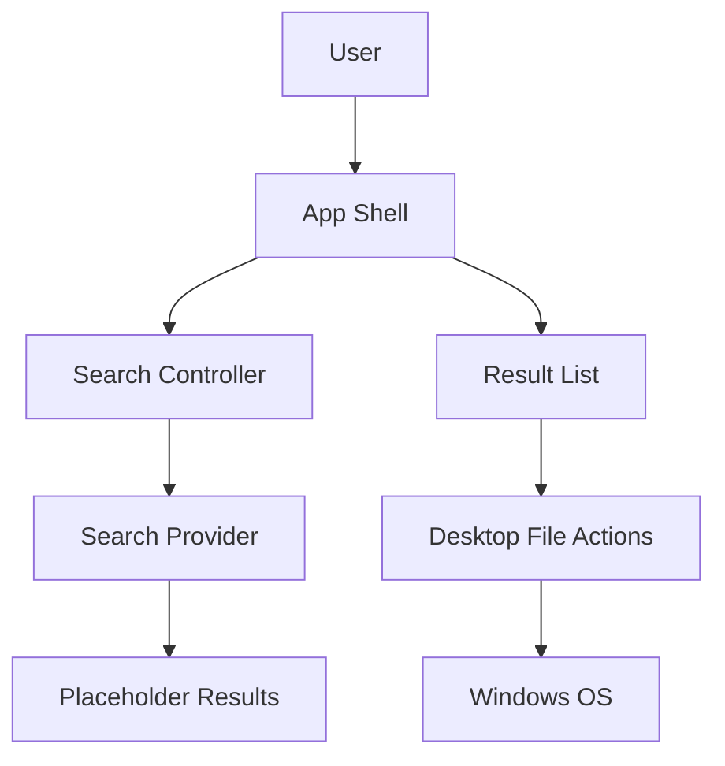
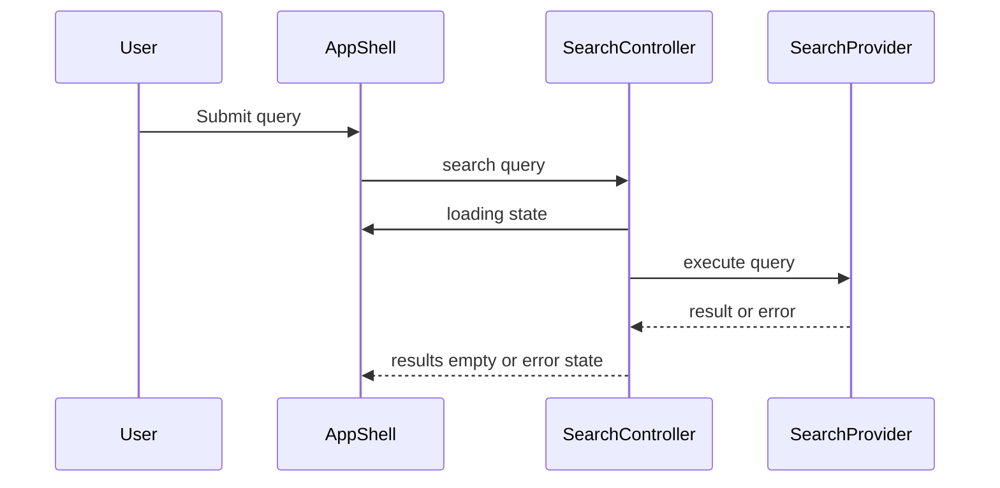
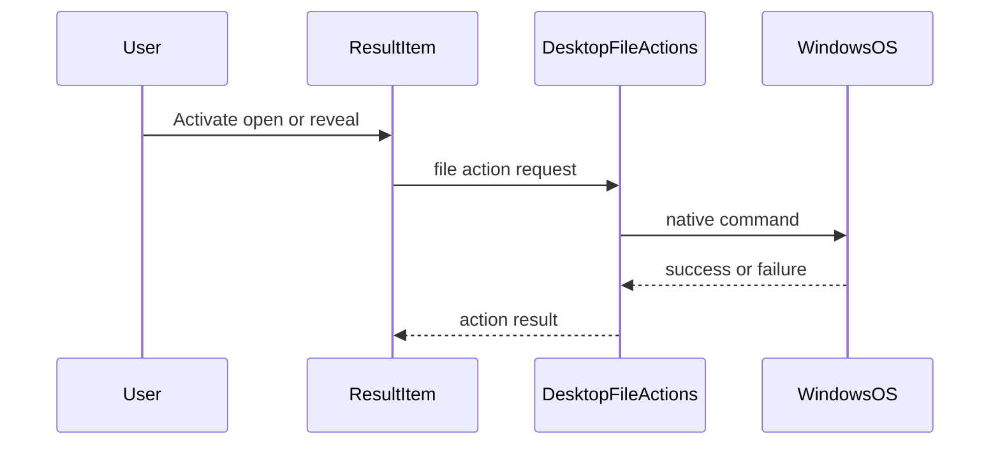

# Design Document

## Overview

This feature delivers the first Windows desktop search shell for users who remember what a file means but not its exact name or folder. It establishes the app frame, search workflow, result presentation contract, and native file actions before indexing and semantic retrieval systems exist.

The shell is implemented as a Tauri 2 desktop app with a React and TypeScript UI. Search is contract-first: the UI consumes a typed provider that can initially return placeholder or simple local results and later be replaced by indexing or semantic providers without redesigning the workflow.

### Goals

- Provide a first-screen search utility with natural language input, ranked results, and clear search states.
- Stabilize the result contract used by future indexing and semantic search specs.
- Support Windows file open and reveal actions through a safe platform boundary.
- Keep the implementation local-first and understandable without exposing AI or indexing internals.

### Non-Goals

- Index local files or maintain freshness state.
- Extract document content, OCR images, generate captions, create embeddings, or query vector storage.
- Build advanced preview, editing, cloud sync, provider settings, or resource management controls.
- Guarantee support for every Windows file type beyond invoking default OS file handling.

## Boundary Commitments

### This Spec Owns

- The Windows desktop app shell, first-screen search layout, navigation, and keyboard focus workflow.
- The typed search result contract consumed by the shell.
- Placeholder or simple local SearchProvider behavior that proves the UI workflow.
- Result list rendering, metadata display, optional snippet/caption display, and result selection state.
- Initial, loading, empty, result, and error UI states.
- Open file and reveal in folder actions as user-facing desktop commands.

### Out of Boundary

- Filesystem crawling, watching, index scheduling, and persisted index state.
- Content extraction, OCR, image captioning, embeddings, vector storage, and ranking algorithms.
- AI model or provider selection.
- Folder exclusions, privacy settings, remote processing modes, and resource throttling controls.
- Rich document/image previews, file editing, and cloud sync.

### Allowed Dependencies

- Tauri 2 runtime and Rust commands for native desktop integration.
- React, TypeScript, Vite, and Fluent UI React for the user interface.
- Local fixture data or simple local result data implementing the SearchProvider contract.
- Windows OS default application and Explorer behavior through the DesktopFileActions boundary.

### Revalidation Triggers

- SearchResult contract shape, including bounded `availabilityHint` semantics, field semantics, or action eligibility changes.
- SearchProvider method signature or error envelope changes.
- DesktopFileActions behavior, permission model, or runtime prerequisite changes.
- UI state model changes that affect loading, empty, error, selected result, or keyboard navigation behavior.

## Architecture

### Existing Architecture Analysis

The repository has no existing app implementation for this feature. Only roadmap, brief, templates, and skill files are present. This design therefore includes scaffolding and establishes the initial project structure rather than integrating with an existing shell.

### Architecture Pattern & Boundary Map

**Architecture Integration**:
- Selected pattern: Contract-first desktop shell with typed UI state and platform adapters.
- Domain boundaries: UI presentation depends on SearchProvider and DesktopFileActions contracts; provider and platform implementations do not import UI components.
- Existing patterns preserved: Kiro staged spec boundaries from the roadmap.
- New components rationale: SearchProvider stabilizes downstream search integration, DesktopFileActions isolates native commands, SearchController coordinates state without embedding rendering details.
- Steering compliance: Local-first Windows MVP, explicit control boundaries, replaceable AI/search provider path.



### Technology Stack

| Layer | Choice / Version | Role in Feature | Notes |
|-------|------------------|-----------------|-------|
| Desktop runtime | Tauri 2 | Hosts the Windows desktop app and native file commands | Requires Rust, Microsoft C++ Build Tools, and WebView2 for Windows development |
| Frontend | React 19 + TypeScript 5 | App shell, search input, result list, and stateful UI | Strong typing required; no `any` in public contracts |
| Build tooling | Vite 6 | Frontend dev server and bundling for Tauri | Keeps app shell setup compact |
| UI components | Fluent UI React v9 | Windows-aligned controls, focus states, and accessibility primitives | Use restrained utility layout |
| Testing | Vitest + React Testing Library + Playwright | Unit, integration, and UI workflow validation | Playwright validates desktop-like UI flows through the web surface where feasible |

## File Structure Plan

### Directory Structure

```text
package.json                         # Scripts and JavaScript dependencies for the desktop shell
tsconfig.json                        # TypeScript compiler settings
vite.config.ts                       # React and Vite configuration for the UI bundle
index.html                           # Vite entry document
src/
├── main.tsx                         # React app bootstrap
├── app/
│   ├── App.tsx                      # Top-level app composition and layout
│   └── searchState.ts               # Discriminated search state model
├── search/
│   ├── SearchProvider.ts            # Search provider contract and result/error types
│   ├── LocalPlaceholderSearchProvider.ts # Initial provider using fixture or simple local results
│   └── SearchController.ts          # Query submission and state transitions
├── desktop/
│   ├── DesktopFileActions.ts        # File action contract and result envelope
│   └── tauriFileActions.ts          # Tauri-backed open and reveal implementation
├── components/
│   ├── SearchBox.tsx                # Search input and submit affordance
│   ├── ResultList.tsx               # Ranked result collection and keyboard list behavior
│   ├── ResultItem.tsx               # Metadata, match context, selection, and actions
│   └── SearchStatusView.tsx         # Initial, loading, empty, and error states
├── data/
│   └── placeholderResults.ts        # Fixture data that conforms to SearchResult
└── test/
    ├── setup.ts                     # Test environment setup
    └── fixtures.ts                  # Shared test fixtures
src-tauri/
├── tauri.conf.json                  # Tauri app and shell permission configuration
├── Cargo.toml                       # Rust package and Tauri dependencies
└── src/
    ├── main.rs                      # Tauri app entrypoint
    └── file_actions.rs              # Windows file reveal/open command bridge
tests/
└── desktop-search-shell.spec.ts     # End-to-end workflow tests
```

### Modified Files

- None expected because this is the first app shell. If implementation discovers existing project configuration, changes must be limited to files needed to host this feature.

## System Flows

### Search Submission and Results



### File Action



## Requirements Traceability

| Requirement | Summary | Components | Interfaces | Flows |
|-------------|---------|------------|------------|-------|
| 1.1 | App starts with search input ready | AppShell, SearchBox | SearchState | Search Submission and Results |
| 1.2 | Non-empty query initiates search | SearchBox, SearchController | SearchProvider.search | Search Submission and Results |
| 1.3 | Empty query does not issue search | SearchBox, SearchController | SearchState | Search Submission and Results |
| 1.4 | Pending search shows progress and preserves query | SearchController, SearchStatusView | SearchState | Search Submission and Results |
| 1.5 | Repeated searches in same window | AppShell, SearchController | SearchProvider.search | Search Submission and Results |
| 2.1 | Results displayed in ranked order | ResultList | SearchResult.rank | Search Submission and Results |
| 2.2 | Result metadata displayed when available | ResultItem | SearchResult | Search Submission and Results |
| 2.3 | Match context displayed when included | ResultItem | MatchContext | Search Submission and Results |
| 2.4 | Missing optional metadata tolerated | ResultItem | SearchResult | Search Submission and Results |
| 2.5 | Selected or focused result distinguished | ResultList, ResultItem | ResultSelectionState | Search Submission and Results |
| 3.1 | Open file with default app | ResultItem, DesktopFileActions | DesktopFileActions.openFile | File Action |
| 3.2 | Reveal file in containing folder | ResultItem, DesktopFileActions | DesktopFileActions.revealInFolder | File Action |
| 3.3 | File action failure shown without clearing results | ResultItem, SearchStatusView | FileActionResult | File Action |
| 3.4 | Inaccessible file failure explained | DesktopFileActions, ResultItem | FileActionResult | File Action |
| 4.1 | Initial state supports starting search | SearchStatusView, AppShell | SearchState | Search Submission and Results |
| 4.2 | Loading state tied to active query | SearchController, SearchStatusView | SearchState | Search Submission and Results |
| 4.3 | Empty state references active query | SearchStatusView | SearchState | Search Submission and Results |
| 4.4 | Not-ready empty state preserves bounded readiness reason | SearchController, SearchStatusView | SearchState.readiness | Search Submission and Results |
| 4.5 | Error state preserves query | SearchController, SearchStatusView | SearchState | Search Submission and Results |
| 4.6 | New query replaces prior empty or error state | SearchController | SearchState | Search Submission and Results |
| 5.1 | Documented search result contract | SearchProvider | SearchResult | Search Submission and Results |
| 5.2 | Placeholder data uses same contract | LocalPlaceholderSearchProvider | SearchProvider.search | Search Submission and Results |
| 5.3 | Unsupported enrichment ignored | SearchProvider, ResultList | SearchResult | Search Submission and Results |
| 5.4 | Present bounded availability hints | ResultItem | AvailabilityHint | Search Submission and Results |
| 5.5 | User not exposed to AI/indexing internals | AppShell, SearchStatusView | UI copy contract | Search Submission and Results |
| 6.1 | Search and results are first screen | AppShell | Layout contract | Search Submission and Results |
| 6.2 | No blocking marketing or onboarding | AppShell | Layout contract | Search Submission and Results |
| 6.3 | Keyboard navigation across workflow | SearchBox, ResultList, ResultItem | Focus behavior | Search Submission and Results, File Action |
| 6.4 | Local paths visible only in app window | ResultItem | SearchResult.filePath | Search Submission and Results |
| 6.5 | Controls limited to shell scope | AppShell, ResultItem | UI action contract | File Action |

## Components and Interfaces

| Component | Domain/Layer | Intent | Req Coverage | Key Dependencies | Contracts |
|-----------|--------------|--------|--------------|------------------|-----------|
| AppShell | UI | Composes first-screen utility layout | 1.1, 1.5, 4.1, 5.4, 6.1, 6.2, 6.5 | SearchController P0 | State |
| SearchBox | UI | Captures query and submit intent | 1.1, 1.2, 1.3, 6.3 | SearchController P0 | State |
| ResultList | UI | Displays ranked, selectable results | 2.1, 2.5, 5.3, 6.3 | SearchResult P0 | State |
| ResultItem | UI | Shows result metadata and actions | 2.2, 2.3, 2.4, 3.1, 3.2, 3.3, 3.4, 6.4, 6.5 | DesktopFileActions P0 | State |
| SearchStatusView | UI | Displays initial, loading, ready-empty, not-ready-empty, and error states | 1.4, 4.1, 4.2, 4.3, 4.4, 4.5, 4.6, 5.4 | SearchState P0 | State |
| SearchController | Application | Coordinates query submission and search state | 1.2, 1.3, 1.4, 1.5, 4.2, 4.4, 4.5, 4.6 | SearchProvider P0 | Service, State |
| SearchProvider | Contract | Defines provider-agnostic search result exchange | 2.1, 5.1, 5.2, 5.3 | None P0 | Service |
| LocalPlaceholderSearchProvider | Provider | Supplies initial contract-compatible result data | 5.2 | SearchProvider P0 | Service |
| DesktopFileActions | Platform | Opens and reveals files through native desktop behavior | 3.1, 3.2, 3.3, 3.4 | Tauri commands P0 | Service |

### Shared Types

```typescript
type Result<T, E> =
  | { ok: true; value: T }
  | { ok: false; error: E };

interface SearchQuery {
  text: string;
}

type MatchContext =
  | { kind: "snippet"; text: string }
  | { kind: "caption"; text: string }
  | { kind: "explanation"; text: string };

type AvailabilityHint =
  | { kind: "partial"; reason: "indexingPending" | "contentLimited" | "visualLimited" | "providerLimited" }
  | { kind: "unavailable"; reason: "notIndexedYet" | "providerUnavailable" | "policyBlocked" };

type SearchReadiness =
  | { kind: "ready" }
  | { kind: "notReady"; reason: "notIndexedYet" | "providerUnavailable" | "policyBlocked" };

interface SearchResponse {
  results: SearchResult[];
  readiness: SearchReadiness;
}

interface SearchResult {
  id: string;
  rank: number;
  filePath: string;
  displayName: string;
  fileType: string;
  modifiedAt?: string;
  sizeBytes?: number;
  matchContext?: MatchContext;
  availabilityHint?: AvailabilityHint;
  actions: {
    canOpen: boolean;
    canReveal: boolean;
  };
}

type SearchError =
  | { kind: "providerUnavailable"; message: string }
  | { kind: "invalidQuery"; message: string }
  | { kind: "unknown"; message: string };

type SearchState =
  | { status: "initial"; query: "" }
  | { status: "loading"; query: string }
  | { status: "results"; query: string; results: SearchResult[]; readiness: SearchReadiness; selectedId?: string }
  | { status: "empty"; query: string; readiness: SearchReadiness }
  | { status: "error"; query: string; message: string };
```

### Application Layer

#### SearchController

| Field | Detail |
|-------|--------|
| Intent | Validate submitted queries, invoke the provider, and publish a single coherent search state |
| Requirements | 1.2, 1.3, 1.4, 1.5, 4.2, 4.4, 4.5, 4.6 |

**Responsibilities & Constraints**
- Trim only for empty-query validation; preserve the submitted query text for display and provider input.
- Set loading state before awaiting provider results.
- Convert provider success into results or empty state while preserving query-level readiness, and convert provider failure into error state.
- Distinguish ready empty searches from not-ready empty searches using `SearchResponse.readiness`.
- Preserve prior results until a new search begins or an action-level error is displayed.

**Dependencies**
- Inbound: AppShell and SearchBox submit events (P0)
- Outbound: SearchProvider (P0)

**Contracts**: Service [x] / API [ ] / Event [ ] / Batch [ ] / State [x]

##### Service Interface

```typescript
interface SearchController {
  submit(query: SearchQuery): Promise<SearchState>;
  selectResult(resultId: string): SearchState;
}
```

- Preconditions: `query.text` is available from the UI.
- Postconditions: Returned state is one of the SearchState union variants.
- Invariants: Empty or whitespace-only queries never call SearchProvider.

### Search Provider Layer

#### SearchProvider

| Field | Detail |
|-------|--------|
| Intent | Provide ranked results to the shell through a stable contract |
| Requirements | 2.1, 5.1, 5.2, 5.3 |

**Responsibilities & Constraints**
- Return results sorted by ascending rank or provide rank values that the shell can sort deterministically.
- Include required identity, path, display name, file type, rank, and action eligibility fields.
- Permit optional metadata, match context, and bounded availability hints without requiring all providers to enrich every result.
- Treat `availabilityHint` as UI-safe only; it may explain partial indexing or unavailability with the fixed enum reasons, but it must not expose pipeline names, model names, vector details, raw content, or provider diagnostics.
- Ignore provider-specific fields at the UI boundary.

**Dependencies**
- Inbound: SearchController (P0)
- Outbound: Placeholder data for first implementation (P1)

**Contracts**: Service [x] / API [ ] / Event [ ] / Batch [ ] / State [ ]

##### Service Interface

```typescript
interface SearchProvider {
  search(query: SearchQuery): Promise<Result<SearchResponse, SearchError>>;
}
```

- Preconditions: Query text is non-empty.
- Postconditions: Result array is contract-valid, query-level readiness is present, and errors are normalized to SearchError.
- Invariants: Unsupported enrichment does not alter the public SearchResult contract.
- Invariants: Empty not-ready searches use query-level `readiness`; per-result partial states use `availabilityHint`.

#### LocalPlaceholderSearchProvider

| Field | Detail |
|-------|--------|
| Intent | Make the shell usable before real indexing and retrieval exist |
| Requirements | 5.2 |

**Implementation Notes**
- Integration: Uses fixture or simple local data that conforms to SearchResult.
- Validation: Contract tests verify every placeholder result has required fields and action flags.
- Risks: Placeholder filtering must not imply final semantic ranking behavior.

### Platform Layer

#### DesktopFileActions

| Field | Detail |
|-------|--------|
| Intent | Execute native open and reveal actions and return user-presentable failures |
| Requirements | 3.1, 3.2, 3.3, 3.4 |

**Responsibilities & Constraints**
- Validate that an action is eligible before invoking native behavior.
- Open files through the OS default application.
- Reveal files in Explorer or the containing folder through a Windows-specific command path.
- Return failure messages without mutating current search results.

**Dependencies**
- Inbound: ResultItem action controls (P0)
- External: Tauri shell plugin or Rust command bridge (P0)
- External: Windows default app and Explorer behavior (P0)

**Contracts**: Service [x] / API [ ] / Event [ ] / Batch [ ] / State [ ]

##### Service Interface

```typescript
type FileActionError =
  | { kind: "notAllowed"; message: string }
  | { kind: "notFound"; message: string }
  | { kind: "osFailure"; message: string };

interface DesktopFileActions {
  openFile(result: SearchResult): Promise<Result<void, FileActionError>>;
  revealInFolder(result: SearchResult): Promise<Result<void, FileActionError>>;
}
```

- Preconditions: Result includes `filePath` and corresponding action eligibility is true.
- Postconditions: Successful actions invoke OS behavior; failed actions return FileActionError.
- Invariants: File action failure does not clear or reorder current results.

### UI Layer

#### AppShell

| Field | Detail |
|-------|--------|
| Intent | Present the first-screen desktop utility workflow |
| Requirements | 1.1, 1.5, 4.1, 5.4, 6.1, 6.2, 6.5 |

**Implementation Notes**
- Integration: Composes SearchBox, SearchStatusView, and ResultList around SearchController state.
- Validation: Initial render shows search as the primary interaction with no blocking marketing or onboarding.
- Risks: Avoid adding settings or indexing controls that belong to later specs.

#### SearchBox

| Field | Detail |
|-------|--------|
| Intent | Capture natural language file-memory queries |
| Requirements | 1.1, 1.2, 1.3, 6.3 |

**Implementation Notes**
- Integration: Submits non-empty text to SearchController.
- Validation: Keyboard submit works and empty submit does not call the provider.

#### ResultList

| Field | Detail |
|-------|--------|
| Intent | Render ranked, keyboard-navigable results |
| Requirements | 2.1, 2.5, 5.3, 6.3 |

**Implementation Notes**
- Integration: Receives SearchResult array and query-level readiness from SearchState.
- Validation: Results appear in rank order and selection/focus is visible.

#### ResultItem

| Field | Detail |
|-------|--------|
| Intent | Present file metadata, match context, and desktop actions |
| Requirements | 2.2, 2.3, 2.4, 3.1, 3.2, 3.3, 3.4, 6.4, 6.5 |

**Implementation Notes**
- Integration: Calls DesktopFileActions for open and reveal commands.
- Validation: Missing optional metadata does not hide the result; action failures show messages while preserving results.

#### SearchStatusView

| Field | Detail |
|-------|--------|
| Intent | Communicate initial, loading, empty, and error states |
| Requirements | 1.4, 4.1, 4.2, 4.3, 4.4, 4.5, 5.4 |

**Implementation Notes**
- Integration: Derives display and bounded readiness feedback from SearchState only.
- Validation: Empty and error states reference the active query and never mention embeddings, OCR, or indexing internals.

## Data Models

### Domain Model

- `SearchQuery`: user-entered natural language text.
- `SearchResult`: ranked local file candidate with metadata and action eligibility.
- `MatchContext`: optional user-facing reason a result matched.
- `SearchState`: discriminated app state controlling the visible shell.
- `FileActionResult`: success or typed failure from desktop file actions.

### Data Contracts & Integration

- Search providers must implement `SearchProvider.search` and return a `SearchResponse` with query-level readiness metadata.
- The shell consumes only the SearchResult fields defined in this spec.
- `availabilityHint` is the only shell-level field for partial indexing metadata; downstream providers must map their internal status to the bounded reasons defined here.
- Additional downstream enrichment must be ignored unless the shell contract is intentionally versioned.
- Placeholder results must pass the same validation as future provider results.

## Error Handling

### Error Strategy

- Empty queries are handled locally and do not create provider errors.
- Provider failures become an error SearchState that preserves the query.
- Provider not-ready success responses become empty SearchState values with bounded readiness reasons.
- File action failures return FileActionError and display an action-level message without clearing results.
- Missing optional result metadata is treated as normal display degradation, not an error.

### Monitoring

- During MVP implementation, console-level development logging is sufficient for provider and file action failures.
- Later privacy/performance controls may add structured diagnostics; that is out of boundary for this spec.

## Testing Strategy

### Unit Tests

- SearchController does not call SearchProvider for empty or whitespace-only queries.
- SearchController transitions through loading and resolves to results, empty, or error states.
- SearchProvider contract validation rejects fixture results missing required fields.
- DesktopFileActions maps native failures to FileActionError without throwing unhandled errors.

### Integration Tests

- Submitting a query renders ranked results with available metadata and match context.
- Missing optional metadata still renders a usable result row.
- Open and reveal controls call DesktopFileActions only when action eligibility allows.
- A new query replaces an empty or error state with loading and then current results.

### E2E/UI Tests

- Initial launch shows the search input and no blocking onboarding surface.
- Keyboard workflow moves from search input to results and primary result actions.
- Empty result and provider error states preserve and reference the active query.
- File action failure displays an actionable message while keeping current results visible.

### Performance/Load

- The shell remains responsive while placeholder searches resolve.
- Rendering a representative result list does not shift the search input or action controls.
- Repeated searches from the same window do not accumulate stale state.

## Security Considerations

- The shell displays local file paths only inside the desktop app window.
- Native file actions are limited to explicit user activation on a displayed result.
- Runtime shell permissions must be scoped to required open/reveal behavior.
- The UI must not expose indexing, OCR, embedding, vector storage, or provider internals.

## Performance & Scalability

- The MVP shell optimizes perceived responsiveness for repeated local searches.
- Provider calls are asynchronous and represented by SearchState so the UI does not freeze.
- Result rendering should be structured so later virtualization can be added if high result counts require it, but virtualization is not required for this shell spec.
