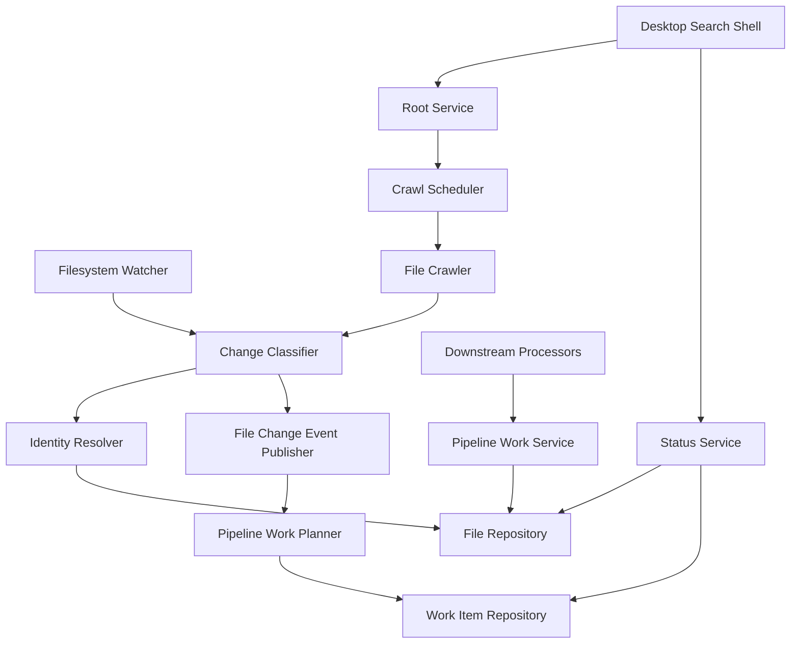
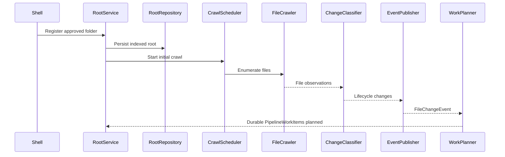
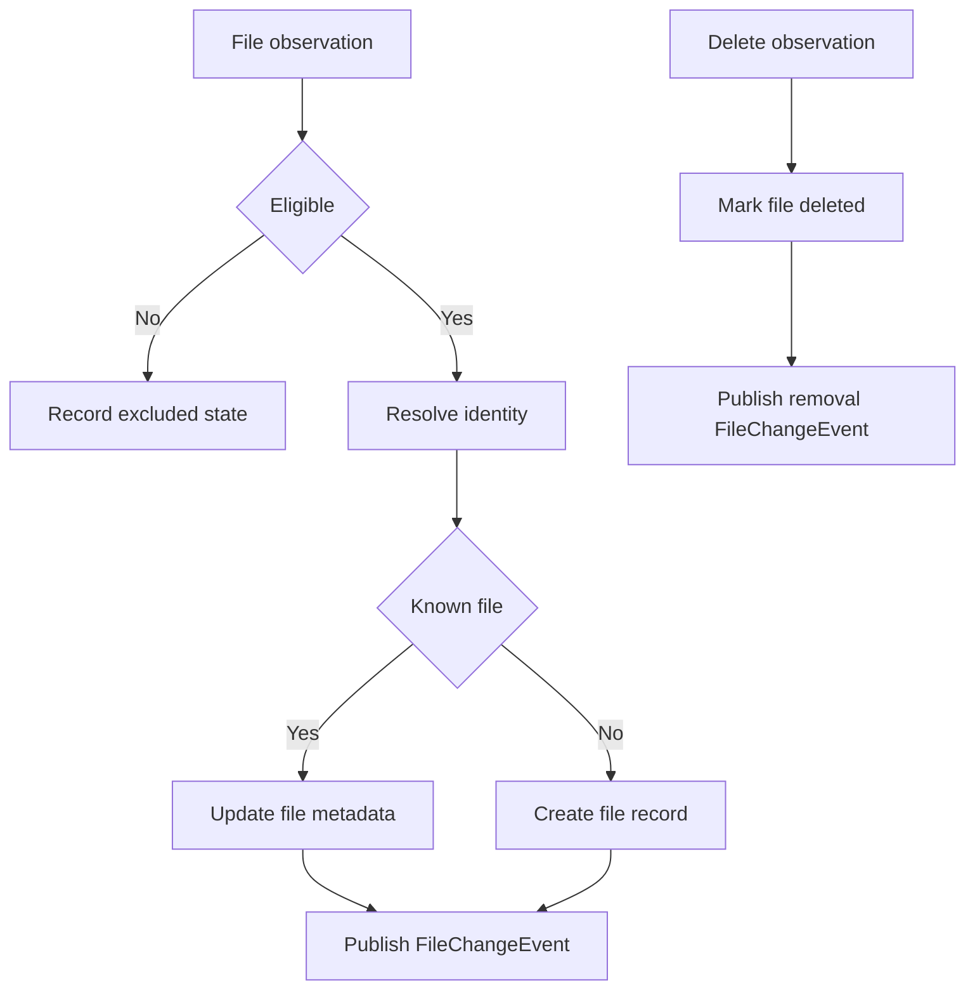
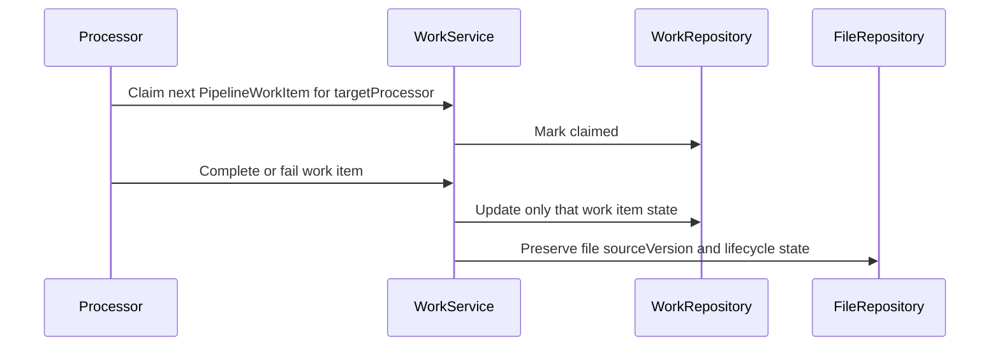
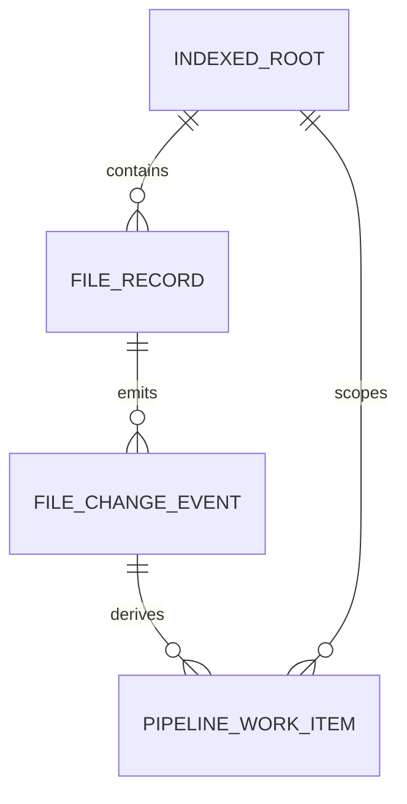

# Design Document

## Overview

This feature delivers the local file indexing core for Windows users who expect semantic search results to stay current as files change inside approved folders. It changes the current project state by adding durable indexed roots, file records with canonical source versions, file freshness state, base file-change events, and per-pipeline work items that downstream extraction and visual pipelines can consume asynchronously.

The indexer is contract-first and local-first. It accepts folder selections from the Desktop Search Shell, performs initial and reconciliation crawls, watches for filesystem changes, maintains stable file lifecycle records, and exposes aggregate status. It does not parse content, generate OCR/captions, create embeddings, rank results, or own desktop UI polish.

### Goals

- Persist user-approved indexed roots, file records, file-change events, and pipeline work item state across restarts.
- Detect created, modified, moved, deleted, excluded, and inaccessible files inside indexed roots.
- Publish durable downstream work for indexing and removal while coalescing duplicate per-pipeline work items.
- Expose freshness and recovery status without leaking extraction or vector-search internals.

### Non-Goals

- Extract text, images, captions, tags, chunks, embeddings, or semantic rankings.
- Implement vector storage, query retrieval, or search result explanation.
- Build advanced folder-management UI or privacy/performance settings beyond status contracts.
- Sync indexes remotely or index folders that the user has not approved.

## Boundary Commitments

### This Spec Owns

- Indexed root registration, removal, availability state, and persisted root scope.
- File discovery, eligibility filtering, file identity matching, metadata capture, and deleted-file state.
- Canonical `sourceVersion` values on `FileRecord`, `FileChangeEvent`, and `PipelineWorkItem`.
- Durable base `FileChangeEvent` records and derived `PipelineWorkItem` records with target processor ownership.
- Freshness, scan, watcher, recovery, and aggregate status snapshots for shell and downstream consumers.
- Contracts for downstream processors to claim, complete, fail, and retry only their own `PipelineWorkItem` stream.

### Out of Boundary

- Document parsing, OCR, image captioning, semantic chunking, embedding generation, ranking, and retrieval.
- Native open or reveal file actions already owned by the Desktop Search Shell.
- AI provider selection, local/remote processing mode controls, folder exclusion UI, and resource throttling policy.
- Enterprise policy, remote sync, cloud backup, email/calendar/browser indexing, and mobile support.

### Allowed Dependencies

- Desktop Search Shell for approved folder inputs and presentation of status snapshots.
- Windows filesystem APIs or a watcher library for file events inside registered roots.
- Local embedded persistence for root, file, file-change event, and pipeline work item state.
- Downstream extraction, vision, and search processors only through work item and file-record contracts.

### Revalidation Triggers

- Changes to `IndexedRoot`, `FileRecord`, `FileIdentity`, `FileChangeEvent`, `PipelineWorkItem`, or `IndexStatusSnapshot` contract shape.
- Changes to work item lifecycle states, target processor names, coalescing rules, completion semantics, or deletion handling.
- Changes to dependency direction between indexer, shell, extraction, or search providers.
- Changes to startup recovery behavior, persistence runtime prerequisites, or folder scope enforcement.

## Architecture

### Existing Architecture Analysis

The repository currently contains specifications but no implementation for the indexing core. The upstream Desktop Search Shell design establishes a Tauri 2, React, and TypeScript app shell with a `SearchProvider` result contract and explicitly excludes crawling, watching, index scheduling, and persisted index state. This design therefore adds a new indexing domain that the shell can call for root registration and status while downstream processors consume file records and pipeline work items.

### Architecture Pattern & Boundary Map

**Architecture Integration**:
- Selected pattern: Ports and adapters around a file-indexing domain core.
- Dependency direction: Types and config -> repositories -> domain services -> runtime orchestrators -> shell/downstream adapters.
- Domain boundaries: The indexer owns file lifecycle, base file-change events, and per-pipeline work item routing; extraction owns content payloads; search owns embeddings and retrieval.
- Existing patterns preserved: Local-first Windows MVP, contract-first integration, and user-approved folder boundaries.
- New components rationale: Crawling, watching, identity matching, file-change event publishing, work item planning, and status aggregation are separate because they can be tested and evolved independently while sharing persisted state.



### Technology Stack

| Layer | Choice / Version | Role in Feature | Notes |
|-------|------------------|-----------------|-------|
| Desktop runtime | Tauri 2 | Hosts the Windows app process that starts crawl/watch orchestration | Aligns with desktop-search-shell |
| Application language | TypeScript 5 and Rust where native IO is required | Defines shared contracts and platform integration | Public TypeScript contracts must avoid `any` |
| Filesystem | Windows filesystem APIs through a watcher adapter | Receives create, modify, rename, and delete observations | Crawl reconciliation remains authoritative for missed events |
| Data / Storage | Local embedded database adapter | Persists indexed roots, file records, file-change events, and pipeline work items | Specific engine can be selected during implementation if it supports transactions and indexes |
| Messaging / Work | Local durable file-change event and work item tables | Hands off indexing and removal work to named downstream processors | No external queue required for MVP |

## File Structure Plan

### Directory Structure

```text
src/
├── indexer/
│   ├── types.ts                    # Shared indexed root, file, identity, file-change, work item, status, and error contracts
│   ├── eligibility.ts              # Extension, type, and ignored-path eligibility decisions
│   ├── identityResolver.ts         # Stable identity matching and confidence fallback rules
│   ├── changeClassifier.ts         # Converts crawl and watcher observations into file lifecycle changes
│   ├── fileChangeEventPublisher.ts # Persists base file lifecycle events with canonical sourceVersion
│   ├── pipelineWorkPlanner.ts      # Derives and coalesces per-pipeline work items from file-change events
│   ├── statusAggregator.ts         # Builds aggregate freshness, scan, watcher, and recovery snapshots
│   ├── rootService.ts              # Registers, removes, and reports indexed roots
│   ├── crawlScheduler.ts           # Starts initial and reconciliation crawls without blocking the shell
│   ├── fileCrawler.ts              # Enumerates files under indexed roots and emits observations
│   ├── filesystemWatcher.ts        # Watches registered roots and emits observations
│   ├── jobService.ts               # Downstream PipelineWorkItem claim, completion, failure, and retry operations
│   ├── repositories/
│   │   ├── rootRepository.ts       # Persistence contract for indexed roots
│   │   ├── fileRepository.ts       # Persistence contract for file records and metadata freshness
│   │   └── jobRepository.ts        # Persistence contract for durable file-change events and work items
│   └── storage/
│       ├── schema.ts               # Physical schema and migration definitions
│       └── localIndexerStore.ts    # Transactional embedded-store adapter
src-tauri/
└── src/
    └── indexer_fs.rs               # Windows filesystem metadata and watcher bridge if implemented natively
tests/
└── local-file-indexer/
    ├── eligibility.test.ts
    ├── change-classifier.test.ts
    ├── job-planner.test.ts
    ├── persistence-recovery.test.ts
    └── root-scan-flow.test.ts
```

### Modified Files

- `src/app/App.tsx` or equivalent shell composition file -- add calls to root registration and status snapshot APIs only when integrating the indexer with the shell.
- `src/search/SearchProvider.ts` or future provider adapter -- later search providers may use `FileRecord.id`, `sourceVersion`, and canonical file metadata; shell result field additions are owned by Desktop Search Shell.
- `src-tauri/tauri.conf.json` -- add only filesystem permissions required for registered roots and watcher operation.

## System Flows

### Root Registration and Initial Crawl



### Live Change and Reconciliation



### Downstream Work Item Completion



## Requirements Traceability

| Requirement | Summary | Components | Interfaces | Flows |
|-------------|---------|------------|------------|-------|
| 1.1 | Register approved root | RootService, RootRepository | IndexedRoot | Root Registration and Initial Crawl |
| 1.2 | Persist root for restart | RootService, RootRepository | IndexedRoot | Root Registration and Initial Crawl |
| 1.3 | Report unavailable roots safely | RootService, StatusAggregator | RootStatus | Root Registration and Initial Crawl |
| 1.4 | Remove root eligibility | RootService, CrawlScheduler, FilesystemWatcher | IndexedRootStatus | Live Change and Reconciliation |
| 1.5 | Enforce registered root boundary | FileCrawler, FilesystemWatcher, EligibilityService | FileObservation | Root Registration and Initial Crawl |
| 2.1 | Discover eligible files | FileCrawler, EligibilityService | FileObservation | Root Registration and Initial Crawl |
| 2.2 | Capture metadata | FileCrawler, FileRepository | FileRecord | Root Registration and Initial Crawl |
| 2.3 | Record recoverable discovery issues | FileCrawler, StatusAggregator | IndexerError | Root Registration and Initial Crawl |
| 2.4 | Expose scan progress | CrawlScheduler, StatusAggregator | ScanStatus | Root Registration and Initial Crawl |
| 2.5 | Mark scan completion | CrawlScheduler, RootRepository | ScanStatus | Root Registration and Initial Crawl |
| 3.1 | Exclude unsupported types | EligibilityService, FileRepository | EligibilityDecision | Live Change and Reconciliation |
| 3.2 | Exclude ignored paths | EligibilityService, FileRepository | EligibilityDecision | Live Change and Reconciliation |
| 3.3 | Re-evaluate eligibility | EligibilityService, CrawlScheduler | EligibilityDecision | Live Change and Reconciliation |
| 3.4 | Distinguish excluded and missing | FileRepository, StatusAggregator | FileRecord.status | Live Change and Reconciliation |
| 3.5 | Expose exclusion reason | EligibilityService, FileRepository | ExclusionReason | Live Change and Reconciliation |
| 4.1 | Assign stable identity | IdentityResolver, FileRepository | FileIdentity | Live Change and Reconciliation |
| 4.2 | Update matched records | IdentityResolver, FileRepository | FileRecord | Live Change and Reconciliation |
| 4.3 | Preserve prior uncertain records | IdentityResolver, FileRepository | FileIdentityMatch | Live Change and Reconciliation |
| 4.4 | Preserve continuity across path changes | IdentityResolver, FileRepository | FileRecord | Live Change and Reconciliation |
| 4.5 | Track freshness | ChangeClassifier, FileRepository | FreshnessState | Live Change and Reconciliation |
| 5.1 | Queue created files | ChangeClassifier, FileChangeEventPublisher, PipelineWorkPlanner | FileChangeEvent, PipelineWorkItem | Live Change and Reconciliation |
| 5.2 | Mark modified files stale | ChangeClassifier, FileChangeEventPublisher, PipelineWorkPlanner | FreshnessState, FileChangeEvent | Live Change and Reconciliation |
| 5.3 | Mark deleted files | ChangeClassifier, FileChangeEventPublisher, PipelineWorkPlanner | FileRecord.status, PipelineWorkItem | Live Change and Reconciliation |
| 5.4 | Reconcile missed changes | CrawlScheduler, FileCrawler, ChangeClassifier | ReconciliationRun | Live Change and Reconciliation |
| 5.5 | Avoid shell blocking | CrawlScheduler, FilesystemWatcher | IndexerRuntime | Root Registration and Initial Crawl |
| 6.1 | Create durable pipeline work items | PipelineWorkPlanner, JobRepository | PipelineWorkItem | Downstream Work Item Completion |
| 6.2 | Create durable removal work items | PipelineWorkPlanner, JobRepository | PipelineWorkItem | Downstream Work Item Completion |
| 6.3 | Coalesce duplicate work | PipelineWorkPlanner, JobRepository | PipelineWorkKey | Downstream Work Item Completion |
| 6.4 | Settle work independently | JobService, FileRepository | PipelineWorkSettlement | Downstream Work Item Completion |
| 6.5 | Retain retryable failures | JobService, JobRepository | PipelineWorkFailure | Downstream Work Item Completion |
| 7.1 | Expose aggregate freshness | StatusAggregator | IndexStatusSnapshot | Root Registration and Initial Crawl |
| 7.2 | Expose root errors | StatusAggregator, RootRepository | RootStatus | Root Registration and Initial Crawl |
| 7.3 | Recover after restart | RootRepository, FileRepository, JobRepository | RecoveryState | Downstream Work Item Completion |
| 7.4 | Expose recovery status | StatusAggregator | IndexStatusSnapshot | Downstream Work Item Completion |
| 7.5 | Hide downstream internals in status | StatusAggregator | IndexStatusSnapshot | Root Registration and Initial Crawl |

## Components and Interfaces

| Component | Domain/Layer | Intent | Req Coverage | Key Dependencies | Contracts |
|-----------|--------------|--------|--------------|------------------|-----------|
| RootService | Application | Manage indexed root lifecycle | 1.1, 1.2, 1.3, 1.4 | RootRepository P0, CrawlScheduler P0, FilesystemWatcher P1 | Service, State |
| FileCrawler | Runtime | Enumerate files under roots | 1.5, 2.1, 2.2, 2.3, 5.4 | RootService P0, Filesystem adapter P0 | Batch |
| FilesystemWatcher | Runtime | Emit live change observations | 1.4, 1.5, 5.1, 5.2, 5.3, 5.5 | RootRepository P0, watcher adapter P0 | Event |
| EligibilityService | Domain | Decide whether files are indexable | 3.1, 3.2, 3.3, 3.5 | Config P0 | Service |
| IdentityResolver | Domain | Match observations to stable records | 4.1, 4.2, 4.3, 4.4 | FileRepository P0 | Service |
| ChangeClassifier | Domain | Convert observations into lifecycle changes | 4.5, 5.1, 5.2, 5.3, 5.4 | EligibilityService P0, IdentityResolver P0 | Service |
| FileChangeEventPublisher | Domain | Persist base file lifecycle events with source version traceability | 5.1, 5.2, 5.3, 6.1, 6.2 | JobRepository P0, FileRepository P0 | Event |
| PipelineWorkPlanner | Domain | Create and coalesce current work per target processor | 5.1, 5.2, 5.3, 6.1, 6.2, 6.3 | JobRepository P0, FileRepository P0 | Service |
| JobService | Application | Let downstream processors claim and settle only their target processor work stream | 6.4, 6.5 | JobRepository P0, FileRepository P0 | Service |
| StatusAggregator | Application | Expose freshness, scan, watcher, and recovery status | 2.4, 2.5, 7.1, 7.2, 7.4, 7.5 | RootRepository P0, FileRepository P0, JobRepository P0 | Service, State |
| IndexerStore | Data | Persist root, file, file-change event, and work item state transactionally | 1.2, 6.1, 6.2, 7.3 | Embedded database P0 | State |

### Shared Types

```typescript
type Result<T, E> =
  | { ok: true; value: T }
  | { ok: false; error: E };

type IndexedRootStatus = "active" | "unavailable" | "removed";
type FileLifecycleStatus = "eligible" | "excluded" | "deleted" | "inaccessible";
type FreshnessState = "current" | "stale" | "pending" | "failed" | "removed";
type CanonicalFileType = "document" | "text" | "code" | "image" | "unknown";
type FileChangeKind = "createdOrModified" | "deleted" | "eligibilityChanged";
type PipelineProcessor = "contentExtraction" | "visualEnrichment";
type PipelineWorkType = "processFile" | "removeFile";
type PipelineWorkState = "pending" | "claimed" | "completed" | "failed";

interface IndexedRoot {
  id: string;
  path: string;
  displayName: string;
  status: IndexedRootStatus;
  lastScanStartedAt?: string;
  lastScanCompletedAt?: string;
  unavailableReason?: string;
}

interface FileIdentity {
  identityKey: string;
  confidence: "high" | "fallback";
}

interface FileRecord {
  id: string;
  rootId: string;
  path: string;
  displayName: string;
  extension?: string;
  fileType: CanonicalFileType;
  sizeBytes?: number;
  modifiedAt?: string;
  sourceVersion: string;
  identity: FileIdentity;
  status: FileLifecycleStatus;
  freshness: FreshnessState;
  exclusionReason?: string;
  lastObservedAt: string;
}

interface FileObservation {
  rootId: string;
  path: string;
  kind: "createdOrModified" | "deleted";
  observedAt: string;
  metadata?: {
    displayName: string;
    extension?: string;
    fileType?: CanonicalFileType;
    sizeBytes?: number;
    modifiedAt?: string;
    identityHint?: string;
  };
}

interface FileChangeEvent {
  id: string;
  fileId: string;
  rootId: string;
  kind: FileChangeKind;
  sourceVersion: string;
  observedAt: string;
  reason: "newFile" | "modifiedFile" | "deletedFile" | "eligibilityChanged" | "retry";
}

interface PipelineWorkItem {
  id: string;
  fileChangeEventId: string;
  fileId: string;
  rootId: string;
  sourceVersion: string;
  targetProcessor: PipelineProcessor;
  type: PipelineWorkType;
  state: PipelineWorkState;
  attempts: number;
  failureReason?: string;
  createdAt: string;
  updatedAt: string;
}

interface IndexStatusSnapshot {
  overall: "current" | "working" | "degraded" | "recovering";
  roots: Array<{
    rootId: string;
    path: string;
    status: IndexedRootStatus;
    scanState: "idle" | "scanning" | "failed";
    pendingWorkItems: number;
    failedWorkItems: number;
    message?: string;
  }>;
}
```

Canonical metadata semantics:
- `extension` is the normalized filename suffix, without the leading dot and lowercased when the filesystem allows it; it is used for display and parser hints only.
- `fileType` is the indexer-owned broad classification used for eligibility and downstream routing. Downstream specs must use the same `CanonicalFileType` values and must not add ad hoc values.
- Scanned-document candidacy is derived pipeline metadata, not a `fileType` value.
- `sourceVersion` is the canonical upstream version token derived from stable identity plus observed content-relevant metadata such as modified time, size, and identity hint where available. Downstream specs must consume this exact field name and must not invent alternate file version fields.

### Application Layer

#### RootService

**Responsibilities & Constraints**
- Register only user-approved folder paths as indexed roots.
- Remove roots by marking them removed and stopping associated crawl/watch activity.
- Prevent crawl and watch operations from escaping registered root paths.
- Report unavailable roots without broadening indexing scope.

**Contracts**: Service [x] / API [ ] / Event [ ] / Batch [ ] / State [x]

```typescript
interface RootService {
  registerRoot(path: string): Promise<Result<IndexedRoot, IndexerError>>;
  removeRoot(rootId: string): Promise<Result<IndexedRoot, IndexerError>>;
  listRoots(): Promise<IndexedRoot[]>;
}
```

#### JobService

**Responsibilities & Constraints**
- Return claimable `PipelineWorkItem` records for the requested `targetProcessor` without exposing crawler internals.
- Mark completed processing or removal work independently for the target processor.
- Retain failure reasons and attempts for retryable failures scoped to the work item.

**Contracts**: Service [x] / API [ ] / Event [ ] / Batch [ ] / State [ ]

```typescript
interface JobService {
  claimNextWorkItem(
    targetProcessor: PipelineProcessor,
    workerId: string
  ): Promise<Result<PipelineWorkItem | undefined, IndexerError>>;
  completeWorkItem(workItemId: string): Promise<Result<PipelineWorkItem, IndexerError>>;
  failWorkItem(workItemId: string, failureReason: string): Promise<Result<PipelineWorkItem, IndexerError>>;
}
```

#### StatusAggregator

**Responsibilities & Constraints**
- Summarize scan, watcher, work item, root, and recovery states.
- Keep status user-presentable and free of extraction, OCR, embedding, and vector terminology.
- Provide enough counts and messages for the shell to explain incomplete freshness.

**Contracts**: Service [x] / API [ ] / Event [ ] / Batch [ ] / State [x]

```typescript
interface StatusAggregator {
  getStatusSnapshot(): Promise<IndexStatusSnapshot>;
}
```

### Domain Layer

#### EligibilityService

**Responsibilities & Constraints**
- Evaluate extension, file type, and ignored path rules.
- Return excluded status with a reason when a file should not become downstream work.
- Support re-evaluation of known files when rules change.

**Contracts**: Service [x] / API [ ] / Event [ ] / Batch [ ] / State [ ]

```typescript
type EligibilityDecision =
  | { eligible: true }
  | { eligible: false; reason: "unsupportedType" | "ignoredPath" };

interface EligibilityService {
  evaluate(observation: FileObservation): EligibilityDecision;
}
```

#### IdentityResolver

**Responsibilities & Constraints**
- Prefer stable filesystem identity hints when available.
- Fall back to path and metadata matching when stable identity is unavailable.
- Create new records when identity confidence is insufficient.

**Contracts**: Service [x] / API [ ] / Event [ ] / Batch [ ] / State [ ]

```typescript
type IdentityResolution =
  | { kind: "matched"; file: FileRecord }
  | { kind: "new"; identity: FileIdentity };

interface IdentityResolver {
  resolve(observation: FileObservation): Promise<IdentityResolution>;
}
```

#### ChangeClassifier

**Responsibilities & Constraints**
- Process crawl and watcher observations through identical lifecycle rules.
- Mark new and changed eligible files stale or pending.
- Mark deleted files deleted and prevent new indexing work for prior contents.

**Contracts**: Service [x] / API [ ] / Event [ ] / Batch [ ] / State [ ]

```typescript
type FileLifecycleChange =
  | { kind: "eligibleCreatedOrModified"; file: FileRecord }
  | { kind: "excluded"; file: FileRecord }
  | { kind: "deleted"; file: FileRecord }
  | { kind: "issue"; rootId: string; path: string; error: IndexerError };

interface ChangeClassifier {
  classify(observation: FileObservation): Promise<FileLifecycleChange>;
}
```

#### PipelineWorkPlanner

**Responsibilities & Constraints**
- Create base `FileChangeEvent` records for new, stale, deleted, or re-eligible files.
- Create derived `PipelineWorkItem` records for `contentExtraction` and/or `visualEnrichment` based on canonical `fileType` and eligibility.
- Coalesce current work by `fileId`, `sourceVersion`, `targetProcessor`, and work type.
- Ensure removal work supersedes stale processing work for deleted files within each target processor stream.

**Contracts**: Service [x] / API [ ] / Event [ ] / Batch [ ] / State [ ]

```typescript
interface PipelineWorkPlanner {
  plan(change: FileLifecycleChange): Promise<Result<PipelineWorkItem[], IndexerError>>;
}
```

### Runtime Layer

#### FileCrawler

**Responsibilities & Constraints**
- Enumerate files under a registered root and emit observations.
- Continue a root scan after recoverable per-file read errors.
- Update scan progress and completion state.

**Contracts**: Service [ ] / API [ ] / Event [ ] / Batch [x] / State [ ]

##### Batch / Job Contract
- Trigger: root registration, app startup recovery, manual reconciliation, or eligibility-rule change.
- Input / validation: active `IndexedRoot`; root path must remain accessible and within registered scope.
- Output / destination: `FileObservation` records sent to `ChangeClassifier`; scan state sent to `StatusAggregator`.
- Idempotency & recovery: repeated crawls may emit duplicate observations; `PipelineWorkPlanner` coalesces resulting work.

#### FilesystemWatcher

**Responsibilities & Constraints**
- Watch active indexed roots for create, modify, rename, and delete events.
- Emit observations only for paths inside active roots.
- Surface watcher failures so reconciliation can recover missed changes.

**Contracts**: Service [ ] / API [ ] / Event [x] / Batch [ ] / State [ ]

##### Event Contract
- Published events: `FileObservation` for created, modified, renamed, or deleted paths; watcher failure status per root.
- Subscribed events: active root registration and removal.
- Ordering / delivery guarantees: watcher ordering is best-effort; reconciliation crawl is the correctness mechanism.

### Data Layer

#### IndexerStore and Repositories

**Responsibilities & Constraints**
- Persist root, file, `FileChangeEvent`, and current `PipelineWorkItem` state transactionally.
- Provide indexes for root path, file identity, file path, source version, file freshness, and current work item lookup.
- Recover pending and failed work items after restart.

**Contracts**: Service [ ] / API [ ] / Event [ ] / Batch [ ] / State [x]

## Data Models

### Domain Model

- `IndexedRoot` is the aggregate for user-approved folder scope and scan availability.
- `FileRecord` is the durable identity and metadata record for a discovered file.
- `FileChangeEvent` is the shared base lifecycle event for a file/source version.
- `PipelineWorkItem` is the target-processor-specific work item derived from a `FileChangeEvent`.
- `IndexStatusSnapshot` is a read model derived from root, file, file-change event, and work item state.



### Logical Data Model

- `indexed_roots`: `id`, `path`, `display_name`, `status`, scan timestamps, unavailable reason.
- `file_records`: `id`, `root_id`, `path`, display metadata, `extension`, `file_type`, identity fields, `source_version`, lifecycle status, freshness, exclusion reason, observation timestamps.
- `file_change_events`: `id`, `file_id`, `root_id`, `kind`, `source_version`, reason, observed timestamp.
- `pipeline_work_items`: `id`, `file_change_event_id`, `file_id`, `root_id`, `source_version`, `target_processor`, work type, state, attempts, failure reason, timestamps.
- Current work uniqueness is enforced by file, source version, work type, target processor, and active work state.
- Deleted and excluded files remain distinct so status and downstream cleanup decisions remain clear.

### Data Contracts & Integration

- The Desktop Search Shell may read `IndexStatusSnapshot` and call `RootService`.
- Downstream processors may call `JobService.claimNextWorkItem(targetProcessor, workerId)` and read `FileRecord` by `fileId`.
- Downstream processors must not mutate root scope, eligibility, identity, or freshness directly.
- Content Extraction Pipeline must use `targetProcessor = "contentExtraction"` and Vision OCR Pipeline must use `targetProcessor = "visualEnrichment"`; each processor settles only its own `PipelineWorkItem`.
- Later semantic search providers may map `FileRecord` metadata into their own `SearchResult` output without changing this spec's file lifecycle ownership.

## Error Handling

### Error Strategy

- Root errors mark a root unavailable or degraded without scanning outside that root.
- Per-file read errors are recorded as recoverable issues and do not stop the whole scan.
- Watcher failures set degraded status and trigger or require reconciliation.
- Job failures remain retryable with a failure reason and attempt count.
- Persistence failures fail fast at the service boundary and avoid reporting false freshness.

### Error Categories and Responses

- **User scope errors**: unavailable or removed roots become root status messages.
- **Filesystem errors**: inaccessible files become file issues or unavailable root status depending on scope.
- **State conflicts**: duplicate observations and duplicate work items are coalesced into current records.
- **Processor errors**: downstream failures update work item state without mutating file identity or source version.

### Monitoring

- MVP implementation should log root scan failures, watcher failures, persistence failures, and repeated work item failures.
- Status snapshots provide user-presentable transparency; detailed diagnostics remain local and are eligible for future privacy/performance controls.

## Testing Strategy

### Unit Tests

- Eligibility decisions include supported, unsupported, ignored, and re-evaluated files.
- Identity resolution updates known records and creates new records when confidence is insufficient.
- Change classification handles created, modified, deleted, excluded, inaccessible, and duplicate observations.
- Pipeline work planning coalesces duplicate work items and prioritizes removal for deleted files within each target processor stream.

### Integration Tests

- Registering a root persists it, starts a crawl, records eligible files, publishes file-change events, and creates work items.
- A reconciliation crawl detects changes missed while the watcher was inactive.
- Restart recovery restores roots, file records, pending work items, failed work items, and recovery status.
- Downstream work item settlement updates only the target processor's state, and work item failure preserves retryable status.

### E2E/UI Tests

- The shell can register an approved folder and display working, current, degraded, and recovering status.
- Removing a root stops eligibility for files under that root.
- Search status presentation does not expose extraction, OCR, embedding, or vector database internals.

### Performance/Load

- Crawls and watcher handling run asynchronously relative to the desktop search surface.
- Large-root scans report progress and recoverable file errors without aborting the entire root.
- Duplicate change storms produce coalesced current work items rather than unbounded duplicate work.

## Security Considerations

- Indexing is constrained to registered indexed roots.
- Removed or unavailable roots must not cause fallback scanning of parent or sibling folders.
- File paths and metadata remain local state for the desktop app and downstream local processors.
- Status messages should avoid exposing more path detail than the shell needs to present.

## Performance & Scalability

- Initial and reconciliation crawls are resumable or restartable and never block the shell event loop.
- Watcher events are treated as low-latency hints; reconciliation provides correctness after downtime.
- Repository indexes must support lookup by root, path, identity, source version, freshness, target processor, and current work item state.
- Job coalescing prevents repeated file changes from producing unbounded downstream work.

## Migration Strategy

No prior indexer schema exists. Initial implementation creates the local indexer schema at first app startup and treats absence of existing data as an empty index.
