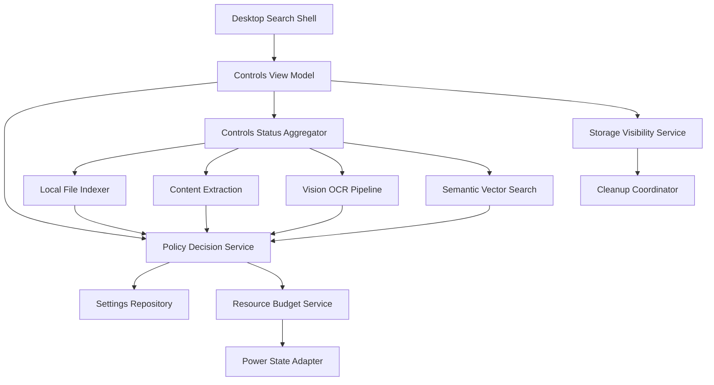
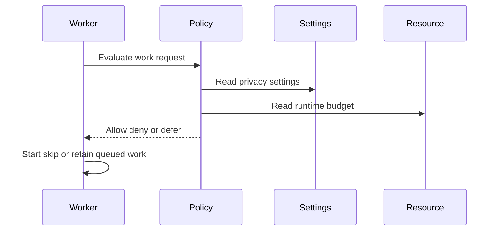
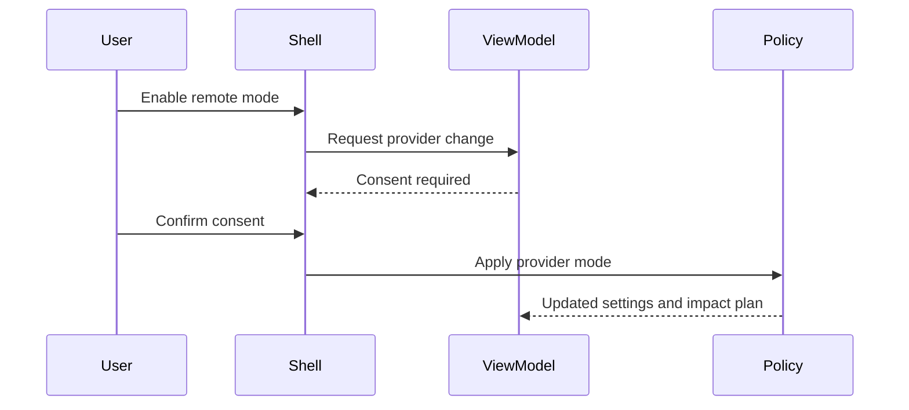
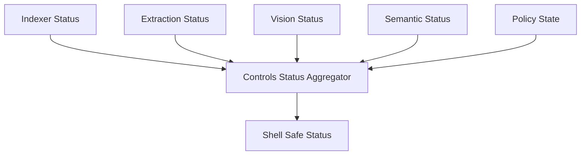

# Design Document

## Overview

This feature delivers the privacy and performance control layer for Windows users who want local semantic file search without surprise indexing, remote processing, or disruptive background load. It changes the staged product by adding persisted policy settings, policy decisions, resource budgets, status aggregation, storage visibility, and shell-facing settings view models.

The design is local-first and enforcement-first. The Local File Indexer, Content Extraction Pipeline, Semantic Vector Search, and Vision OCR Pipeline keep ownership of their processing internals, but they must consult this feature before indexing, reading contents, running OCR/captioning, generating embeddings, or transmitting anything to a remote provider. This spec is the single owner of provider mode names and semantics; downstream semantic and vision code consume decisions through thin adapters.

### Goals

- Enforce indexed scope, exclusions, provider consent, pause state, resource limits, and battery-aware behavior before work starts.
- Provide one shared policy decision contract for indexer, extraction, vision, and semantic workers.
- Expose user-facing settings, status, blocked reasons, and storage visibility through the Desktop Search Shell.
- Preserve privacy-safe defaults and local-first operation.

### Non-Goals

- Implement parsers, OCR engines, embedding models, vector storage, ranking, or result rendering.
- Add enterprise policy, account sync, cloud backup, legal certification, or team audit logging.
- Replace upstream pipeline status ownership; this feature aggregates and normalizes it.
- Enforce OS-level sandboxing or process scheduling beyond MVP worker-consumed budgets.

## Boundary Commitments

### This Spec Owns

- Persisted privacy and performance settings, including indexed scopes, exclusions, provider mode, consent state, pause state, resource limits, battery-aware behavior, and cleanup preferences.
- Policy decision contracts for file eligibility, content extraction, visual processing, content embedding, query embedding, storage cleanup, resource budgeting, and canonical provider mode semantics.
- Normalized status and blocked-reason view models for Desktop Search Shell settings.
- Storage usage aggregation and cleanup orchestration contracts.
- Policy-change impact planning for re-evaluation, regeneration, invalidation, and deferred work.

### Out of Boundary

- File crawling, watching, identity, durable job creation, and file freshness owned by Local File Indexer.
- Text parsing and normalized document payloads owned by Content Extraction Pipeline.
- OCR, captions, visual tags, and visual payloads owned by Vision OCR Pipeline.
- Chunking, embedding execution, vector storage, retrieval, ranking, and search result construction owned by Semantic Vector Search.
- Desktop layout, keyboard navigation, result rendering, and native file actions owned by Desktop Search Shell.

### Allowed Dependencies

- Desktop Search Shell for presenting settings, consent dialogs, and normalized status.
- Local File Indexer root, file, job, and status contracts.
- Content Extraction, Vision OCR, and Semantic Vector Search status and policy hook integration points.
- Local embedded persistence for policy settings and cleanup state.
- Windows power or battery state adapter when available, with a conservative unknown-state fallback.

### Revalidation Triggers

- Changes to policy decision inputs, decision reasons, canonical `ProviderMode` semantics, or consent requirements.
- Changes to upstream `FileRecord`, indexed root, extraction status, visual status, semantic status, or storage usage contracts.
- Changes that move provider settings, exclusions, pause state, or resource policy into an upstream pipeline.
- Changes to cleanup semantics that alter when indexed content, payloads, embeddings, or vectors become unavailable.
- Changes to Desktop Search Shell settings contracts or status presentation requirements.

## Architecture

### Existing Architecture Analysis

The repository currently contains specs only. Upstream designs establish a Tauri 2, React, and TypeScript desktop app; local embedded persistence; background workers; strong TypeScript contracts; and local-first provider policy placeholders. Default steering files are absent, so `.kiro/steering/roadmap.md` is the available project-wide source of truth.

### Architecture Pattern & Boundary Map

**Architecture Integration**:
- Selected pattern: Central policy service with adapters for upstream workers and shell settings.
- Dependency direction: Policy types -> repositories -> domain evaluators -> policy service -> pipeline adapters and shell view models.
- Existing patterns preserved: local-first Windows MVP, staged ownership, provider-neutral AI adapters, background work that does not block the shell, and no `any` in public TypeScript contracts.
- New components rationale: Policy evaluation, settings persistence, status aggregation, resource budgeting, and cleanup orchestration are separate because they have different consumers and validation concerns.



### Technology Stack

| Layer | Choice / Version | Role in Feature | Notes |
|-------|------------------|-----------------|-------|
| Desktop runtime | Tauri 2 | Hosts settings UI integration and local services | Aligns with upstream specs |
| Frontend | React 19 + TypeScript 5 | Settings panels, consent flows, status and storage controls | UI consumes view models only |
| Application language | TypeScript 5 with Rust only for native power or storage adapter needs | Policy contracts, evaluators, settings services, and pipeline adapters | Public contracts must avoid `any` |
| Data / Storage | Local embedded persistence | Stores settings, consent state, policy versions, and cleanup state | Same app storage family as upstream specs |
| Runtime signals | Windows power state adapter | Supports battery-aware deferral | Unknown state should not permit remote or unlimited processing |

## File Structure Plan

### Directory Structure

```text
src/
├── controls/
│   ├── types.ts                         # Policy settings, decisions, reasons, resource budgets, status, and error contracts
│   ├── privacyPolicy.ts                 # Scope, exclusion, provider consent, and modality policy evaluation
│   ├── resourcePolicy.ts                # Pause, throttle, concurrency, CPU, memory, disk, and battery decision logic
│   ├── policyDecisionService.ts         # Shared decision surface consumed by indexer, extraction, vision, and semantic workers
│   ├── policyChangePlanner.ts           # Re-evaluation, regeneration, invalidation, and deferred-work impact plans
│   ├── controlsStatusAggregator.ts      # Normalizes upstream status into shell-safe status and blocked reasons
│   ├── storageVisibilityService.ts      # Aggregates local index storage usage and cleanup eligibility
│   ├── cleanupCoordinator.ts            # Coordinates cleanup requests through upstream stores and current pointers
│   ├── controlsViewModelService.ts      # Shell-facing settings, consent, status, storage, and error view models
│   ├── powerStateAdapter.ts             # Power and battery state port with Windows adapter boundary
│   ├── repositories/
│   │   └── settingsRepository.ts        # Persistence contract for settings, consent, policy version, and cleanup state
│   └── storage/
│       ├── controlsSchema.ts            # Schema and migration definitions for controls settings
│       └── localControlsStore.ts        # Transactional local settings store adapter
├── components/
│   └── settings/
│       ├── PrivacyPerformanceSettings.tsx # Settings composition consumed by Desktop Search Shell
│       ├── IndexedLocationsPanel.tsx       # Indexed roots and exclusions controls
│       ├── ProviderModePanel.tsx           # Local remote hybrid mode and explicit consent flow
│       ├── ResourceControlsPanel.tsx       # Pause resume limits and battery behavior controls
│       ├── IndexingStatusPanel.tsx         # Normalized current pending failed blocked throttled status
│       └── StorageUsagePanel.tsx           # Storage usage and cleanup controls
tests/
└── privacy-performance-controls/
    ├── privacy-policy.test.ts
    ├── resource-policy.test.ts
    ├── policy-decision-service.test.ts
    ├── status-aggregator.test.ts
    ├── storage-cleanup.test.ts
    └── settings-ui.spec.ts
src-tauri/
└── src/
    └── power_state.rs                  # Optional Windows power state command bridge
```

### Modified Files

- `src/indexer/eligibility.ts` or equivalent future indexer hook -- consult `PolicyDecisionService` for approved roots, folder exclusions, file type exclusions, pause, and resource deferral before queuing work.
- `src/extraction/extractionService.ts` or equivalent future extraction hook -- consult policy before reading file contents and before retrying limited work.
- `src/vision/visualEnrichmentService.ts` or equivalent future vision hook -- consult policy before local or remote OCR, captions, and tags.
- `src/semantic-search/embeddings/embeddingPolicy.ts` or equivalent future semantic hook -- delegate provider mode and consent decisions to controls policy.
- `src/app/App.tsx` or equivalent shell composition -- route settings entry to `PrivacyPerformanceSettings` without moving policy semantics into UI.
- Local storage migration entrypoint -- register controls schema alongside indexer, extraction, semantic, and visual schemas.

## System Flows

### Policy Decision Before Work



### Remote Provider Consent



### Status Aggregation



## Requirements Traceability

| Requirement | Summary | Components | Interfaces | Flows |
|-------------|---------|------------|------------|-------|
| 1.1 | Add indexed location | ControlsViewModelService, PrivacyPolicy, SettingsRepository | IndexedLocationSetting | Remote Provider Consent |
| 1.2 | Exclude folder | PrivacyPolicy, PolicyDecisionService | ExclusionRule | Policy Decision Before Work |
| 1.3 | Exclude file type | PrivacyPolicy, PolicyDecisionService | ExclusionRule | Policy Decision Before Work |
| 1.4 | Restrictive exclusion wins | PrivacyPolicy | PolicyDecision | Policy Decision Before Work |
| 1.5 | Re-evaluation after scope changes | PolicyChangePlanner | PolicyImpactPlan | Status Aggregation |
| 2.1 | Local-only default | PrivacyPolicy | ProviderPolicySettings | Policy Decision Before Work |
| 2.2 | Explicit remote consent | ControlsViewModelService, PrivacyPolicy | ConsentState | Remote Provider Consent |
| 2.3 | Deny unallowed remote processing | PolicyDecisionService | PolicyDecision | Policy Decision Before Work |
| 2.4 | Expose active provider mode | ControlsViewModelService | ProviderModeView | Remote Provider Consent |
| 2.5 | Plan regeneration or invalidation | PolicyChangePlanner | PolicyImpactPlan | Status Aggregation |
| 2.6 | Own provider mode names and semantics | PrivacyPolicy, PolicyDecisionService | ProviderMode | Policy Decision Before Work |
| 3.1 | Indexer decision hook | PolicyDecisionService | FilePolicyRequest | Policy Decision Before Work |
| 3.2 | Extraction decision hook | PolicyDecisionService | ContentPolicyRequest | Policy Decision Before Work |
| 3.3 | Vision decision hook | PolicyDecisionService | VisualPolicyRequest | Policy Decision Before Work |
| 3.4 | Semantic decision hook | PolicyDecisionService | EmbeddingPolicyRequest | Policy Decision Before Work |
| 3.5 | Fail closed on missing policy | PolicyDecisionService | PolicyError | Policy Decision Before Work |
| 4.1 | Pause background work | ResourcePolicy, PolicyDecisionService | ResourceBudgetSnapshot | Policy Decision Before Work |
| 4.2 | Preserve allowed search data | PolicyDecisionService, ControlsStatusAggregator | PolicyDecision | Status Aggregation |
| 4.3 | Resume deferred work | ResourcePolicy, PolicyChangePlanner | PolicyImpactPlan | Policy Decision Before Work |
| 4.4 | Expose resource limits | ResourcePolicy, ResourceBudgetService | ResourceBudgetSnapshot | Policy Decision Before Work |
| 4.5 | Expose throttled state | ResourcePolicy, ControlsStatusAggregator | BlockedReason | Status Aggregation |
| 5.1 | Defer expensive work on battery | ResourcePolicy, PowerStateAdapter | PowerStateSnapshot | Policy Decision Before Work |
| 5.2 | Resume on external power | ResourcePolicy | ResourceBudgetSnapshot | Policy Decision Before Work |
| 5.3 | Show waiting for power | ControlsStatusAggregator | BlockedReason | Status Aggregation |
| 5.4 | Honor user battery override | ResourcePolicy | ResourceSettings | Policy Decision Before Work |
| 5.5 | Allow current search on battery | PolicyDecisionService | SearchPolicyDecision | Policy Decision Before Work |
| 6.1 | Aggregate pending work | ControlsStatusAggregator | ControlsStatusSnapshot | Status Aggregation |
| 6.2 | Explain blocked work | ControlsStatusAggregator | BlockedReason | Status Aggregation |
| 6.3 | Location status | ControlsStatusAggregator | LocationStatusView | Status Aggregation |
| 6.4 | Status count categories | ControlsStatusAggregator | ControlsStatusSnapshot | Status Aggregation |
| 6.5 | Hide internals | ControlsViewModelService | ControlsViewModel | Status Aggregation |
| 7.1 | Storage usage | StorageVisibilityService | StorageUsageSnapshot | Status Aggregation |
| 7.2 | Remove location data | CleanupCoordinator | CleanupRequest | Status Aggregation |
| 7.3 | Clear all local index data | CleanupCoordinator | CleanupResult | Status Aggregation |
| 7.4 | Cleanup errors | CleanupCoordinator, ControlsViewModelService | ControlsError | Status Aggregation |
| 7.5 | No upload during cleanup | CleanupCoordinator | CleanupRequest | Status Aggregation |
| 8.1 | Show settings controls | PrivacyPerformanceSettings, ControlsViewModelService | ControlsViewModel | Remote Provider Consent |
| 8.2 | Reflect accepted changes | ControlsViewModelService | SettingsUpdateResult | Remote Provider Consent |
| 8.3 | Consent step for remote mode | ProviderModePanel, ControlsViewModelService | ConsentState | Remote Provider Consent |
| 8.4 | Preserve prior setting on error | ControlsViewModelService | SettingsUpdateResult | Remote Provider Consent |
| 8.5 | Avoid raw content in controls | ControlsViewModelService, UI panels | ControlsViewModel | Status Aggregation |

## Components and Interfaces

| Component | Domain/Layer | Intent | Req Coverage | Key Dependencies | Contracts |
|-----------|--------------|--------|--------------|------------------|-----------|
| SettingsRepository | Data | Persist privacy, provider, resource, battery, and cleanup settings | 1.1, 2.2, 4.4 | LocalControlsStore P0 | State |
| PrivacyPolicy | Domain | Evaluate indexed scope, exclusions, provider mode, consent, and modality rules | 1.2, 1.3, 1.4, 2.1, 2.3 | SettingsRepository P0 | Service |
| ResourcePolicy | Domain | Evaluate pause, throttle, resource budget, and power conditions | 4.1, 4.3, 4.4, 4.5, 5.1, 5.2, 5.4, 5.5 | PowerStateAdapter P1 | Service, State |
| PolicyDecisionService | Application | Provide allow, deny, or defer decisions to all pipelines | 3.1, 3.2, 3.3, 3.4, 3.5 | PrivacyPolicy P0, ResourcePolicy P0 | Service |
| PolicyChangePlanner | Application | Determine re-evaluation, regeneration, invalidation, and deferred-work impacts | 1.5, 2.5, 4.3 | SettingsRepository P0 | Service |
| ControlsStatusAggregator | Application | Normalize upstream status and policy blockers into shell-safe status | 4.2, 4.5, 5.3, 6.1, 6.2, 6.3, 6.4 | Upstream status services P0 | Service, State |
| StorageVisibilityService | Application | Aggregate local storage usage categories | 7.1 | Upstream storage reporters P1 | Service |
| CleanupCoordinator | Application | Coordinate scoped or full local index cleanup | 7.2, 7.3, 7.4, 7.5 | Upstream cleanup ports P0 | Service, Batch |
| ControlsViewModelService | Application | Expose settings, consent, status, storage, and errors to the shell | 2.4, 6.5, 8.1, 8.2, 8.4, 8.5 | PolicyDecisionService P0 | Service, State |
| PrivacyPerformanceSettings | UI | Present controls through the Desktop Search Shell | 8.1, 8.3, 8.5 | ControlsViewModelService P0 | State |

### Shared Types

```typescript
type Result<T, E> =
  | { ok: true; value: T }
  | { ok: false; error: E };

type ProviderMode = "localOnly" | "remoteAllowed" | "hybrid";
type CanonicalFileType = "document" | "text" | "code" | "image" | "unknown";
type NormalizedExtension = string; // lowercased suffix without leading dot, matching Local File Indexer normalization
type WorkModality = "fileDiscovery" | "textExtraction" | "ocr" | "caption" | "tag" | "contentEmbedding" | "queryEmbedding";
type PolicyDecisionKind = "allow" | "deny" | "defer";
type BlockedReason =
  | "outsideIndexedScope"
  | "folderExcluded"
  | "fileTypeExcluded"
  | "remoteConsentRequired"
  | "remoteProviderDenied"
  | "paused"
  | "resourceThrottled"
  | "waitingForPower"
  | "policyUnavailable";

type ExclusionRule =
  | { id: string; kind: "folder"; path: string; enabled: boolean }
  | { id: string; kind: "fileType"; fileType: CanonicalFileType; enabled: boolean }
  | { id: string; kind: "extension"; extension: NormalizedExtension; enabled: boolean };

interface ProviderPolicySettings {
  mode: ProviderMode;
  remoteConsentGranted: boolean;
  allowedRemoteModalities: WorkModality[];
  providerId?: string;
  updatedAt: string;
}

interface ResourceSettings {
  paused: boolean;
  maxConcurrentJobs: number;
  maxCpuPercent?: number;
  maxMemoryMb?: number;
  maxDiskMb?: number;
  batteryAware: boolean;
  allowExpensiveWorkOnBattery: boolean;
}

interface PolicyDecision {
  kind: PolicyDecisionKind;
  reasons: BlockedReason[];
  policyVersion: string;
  providerMode: ProviderMode;
}

interface PolicyWorkRequest {
  modality: WorkModality;
  fileId?: string;
  rootId?: string;
  path?: string;
  fileType?: CanonicalFileType;
  extension?: NormalizedExtension;
  requiresRemoteProvider: boolean;
  expensive: boolean;
}

interface ControlsStatusSnapshot {
  overall: "current" | "working" | "degraded" | "paused" | "throttled";
  counts: {
    current: number;
    pending: number;
    failed: number;
    excluded: number;
    policyBlocked: number;
    throttled: number;
    removed: number;
  };
  locations: LocationStatusView[];
  blockedReasons: BlockedReason[];
}
```

Provider mode semantics:
- `localOnly`: private content and generated content may be processed only by local providers.
- `remoteAllowed`: remote providers may be used only for modalities with explicit consent and an allow decision.
- `hybrid`: local providers remain preferred, and remote providers may be used only when the policy decision allows fallback for the requested modality.

Semantic Vector Search and Vision OCR Pipeline must import or mirror these exact enum names only at their adapter boundaries (`EmbeddingPolicyAdapter` and `VisionPolicyAdapter`). They do not own alternate values such as `"local"`, `"remote"`, or separate local/remote/hybrid behavior.

Exclusion semantics:
- `fileType` is the canonical broad classification supplied by the Local File Indexer, such as `document`, `image`, `text`, `code`, or `unknown`.
- `extension` is a normalized suffix without the leading dot, such as `pdf`, `docx`, or `png`, and must not be treated as the canonical file type.
- Policy requests may include both fields. Folder rules evaluate path scope, file type rules evaluate `fileType`, and extension rules evaluate the normalized `extension`.

### Application Layer

#### PolicyDecisionService

| Field | Detail |
|-------|--------|
| Intent | Return a single allow, deny, or defer decision before any privacy-sensitive or expensive work begins |
| Requirements | 3.1, 3.2, 3.3, 3.4, 3.5 |

**Responsibilities & Constraints**
- Evaluate indexed scope, folder exclusions, canonical file type exclusions, normalized extension exclusions, provider mode, consent, pause state, runtime resources, and battery conditions.
- Deny remote content transmission unless consent and modality policy explicitly allow it.
- Defer work rather than fail it when pause, throttling, or battery rules are temporary.
- Fail closed when settings cannot be loaded for private content processing.

**Contracts**: Service [x] / API [ ] / Event [ ] / Batch [ ] / State [x]

```typescript
interface PolicyDecisionService {
  evaluate(request: PolicyWorkRequest): Promise<Result<PolicyDecision, PolicyError>>;
  getCurrentPolicyVersion(): Promise<string>;
}
```

#### ControlsViewModelService

| Field | Detail |
|-------|--------|
| Intent | Provide shell-safe settings, consent, status, storage, and errors without exposing processing internals |
| Requirements | 2.4, 6.5, 8.1, 8.2, 8.4, 8.5 |

**Responsibilities & Constraints**
- Return the complete privacy and performance settings view model for the shell.
- Require a consent transition before enabling remote provider modes.
- Preserve previous settings when validation or persistence fails.
- Hide raw file contents, OCR text, captions, embeddings, and vector details.

**Contracts**: Service [x] / API [ ] / Event [ ] / Batch [ ] / State [x]

```typescript
interface ControlsViewModelService {
  getViewModel(): Promise<Result<ControlsViewModel, ControlsError>>;
  previewSettingsChange(change: SettingsChange): Promise<Result<SettingsChangePreview, ControlsError>>;
  applySettingsChange(change: SettingsChange, consent?: ConsentConfirmation): Promise<Result<ControlsViewModel, ControlsError>>;
}
```

#### CleanupCoordinator

| Field | Detail |
|-------|--------|
| Intent | Remove local index artifacts by location or globally while preserving unrelated settings |
| Requirements | 7.2, 7.3, 7.4, 7.5 |

**Responsibilities & Constraints**
- Coordinate cleanup through upstream stores and current-pointer contracts.
- Ensure cleared content becomes unavailable for search until rebuilt.
- Return recoverable cleanup errors without uploading or backing up local data.

**Contracts**: Service [x] / API [ ] / Event [ ] / Batch [x] / State [ ]

```typescript
interface CleanupCoordinator {
  cleanupLocation(rootId: string): Promise<Result<CleanupResult, ControlsError>>;
  cleanupAllIndexData(): Promise<Result<CleanupResult, ControlsError>>;
}
```

## Data Models

### Domain Model

- `ControlsSettings` is the aggregate root for indexed locations, exclusions, provider mode, resource settings, battery behavior, and policy version.
- `PolicyDecision` is a point-in-time decision and must include a policy version so workers can diagnose stale decisions.
- `PolicyImpactPlan` describes files or outputs that require re-evaluation, regeneration, invalidation, or deferred processing after settings changes.
- `ControlsStatusSnapshot` is shell-safe and contains only counts, statuses, locations, and blocked reasons.

### Logical Data Model

| Entity | Natural Key | Key Attributes | Integrity Rules |
|--------|-------------|----------------|-----------------|
| ControlsSettings | singleton | provider mode, consent state, resource settings, battery settings, policy version | Updates increment policy version |
| IndexedLocationSetting | root ID or path | enabled state, display path, created time | Must map to an indexer root before processing |
| ExclusionRule | rule ID | discriminated folder path, canonical file type, or normalized extension payload | Folder exclusions override included roots; extension values use the indexer format without a leading dot |
| ConsentState | provider plus modality | consent granted, granted time, revoked time | Remote processing requires active consent |
| CleanupState | cleanup ID | scope, status, failure reason | Cleanup must not delete settings unless explicitly clearing settings is later added |

### Data Contracts & Integration

- Upstream workers call `PolicyDecisionService.evaluate` with a modality-specific `PolicyWorkRequest` that preserves the Local File Indexer distinction between canonical `fileType` and normalized `extension`.
- Status aggregation consumes upstream status snapshots and maps them to `ControlsStatusSnapshot`.
- Storage visibility consumes upstream storage reporters and returns approximate category sizes.
- Cleanup integration uses upstream cleanup ports; this feature coordinates but does not directly mutate parser, vector, or visual internals.

## Error Handling

### Error Strategy

Policy evaluation errors default to deny for content transmission and defer for recoverable resource-state failures. Settings update failures preserve the prior persisted settings. Cleanup errors report partial completion and require upstream stores to be idempotent.

### Error Categories and Responses

- **User errors**: Invalid exclusion path, unsupported extension rule, or missing consent returns field-level settings errors.
- **Policy errors**: Missing settings, stale policy version, or unavailable power state returns deny or defer decisions with safe reasons.
- **Integration errors**: Upstream status or cleanup reporter failures degrade the affected status category without exposing raw content.

### Monitoring

- Emit local diagnostic events for policy denials, deferrals, settings changes, cleanup failures, and unexpected fail-closed decisions.
- Diagnostics must not include raw file contents, OCR text, captions, embeddings, vectors, or query text.

## Testing Strategy

### Unit Tests

- Verify exclusion precedence for indexed roots, nested excluded folders, canonical file type rules, and normalized extension rules.
- Verify provider policy denies remote processing without explicit consent and allows local-only defaults.
- Verify resource policy returns paused, throttled, waiting-for-power, and allowed decisions correctly.
- Verify policy change planning marks affected files and outputs for re-evaluation, regeneration, or invalidation.

### Integration Tests

- Verify indexer, extraction, vision, and semantic hooks receive allow, deny, and defer decisions for representative requests.
- Verify status aggregation maps upstream current, pending, failed, excluded, policy-blocked, throttled, and removed counts.
- Verify cleanup by location and cleanup-all calls upstream cleanup ports and makes search data unavailable until rebuild.
- Verify settings persistence increments policy version and preserves prior values on failed updates.

### E2E/UI Tests

- Verify the settings surface displays indexed locations, exclusions, provider mode, pause state, resource limits, battery behavior, status, and storage usage.
- Verify enabling remote mode requires explicit consent before settings are applied.
- Verify pause and resume update visible status and worker-facing policy decisions.
- Verify cleanup errors show an actionable message without deleting unrelated settings.

### Performance/Load

- Verify policy decisions remain fast enough for pre-work checks during large crawl and worker batches.
- Verify status aggregation handles high counts without requiring raw file or payload enumeration in the UI.
- Verify throttling decisions prevent unbounded concurrent worker starts under configured limits.

## Security Considerations

- Default policy is local-only and remote-deny.
- Remote provider mode requires explicit consent and modality-specific allowance before content is transmitted.
- Settings and status view models must not include raw file contents, OCR text, image captions, tags, embeddings, vectors, or query text.
- Policy evaluation fails closed for privacy-sensitive work when settings are unavailable.

## Performance & Scalability

- Policy evaluation should be lightweight and cacheable by policy version for worker batches.
- Status aggregation should rely on upstream aggregate counts rather than scanning all files for every UI refresh.
- Resource budgets are soft MVP controls consumed by workers; future OS-level enforcement would require revalidation.
