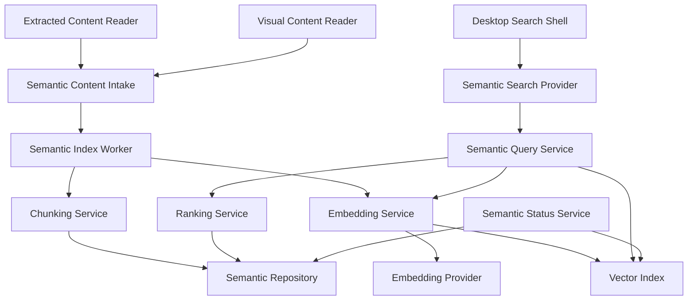
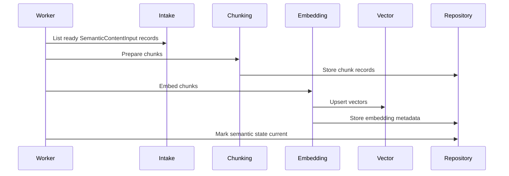
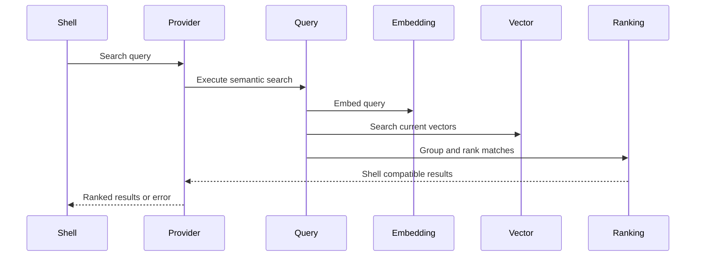
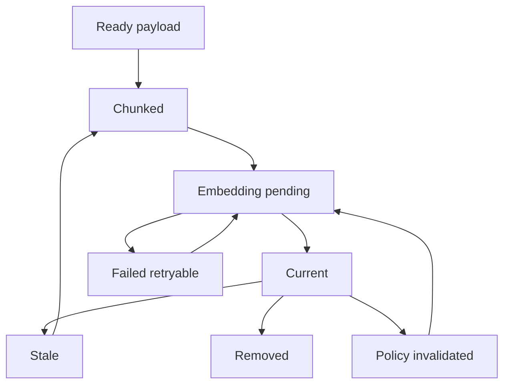
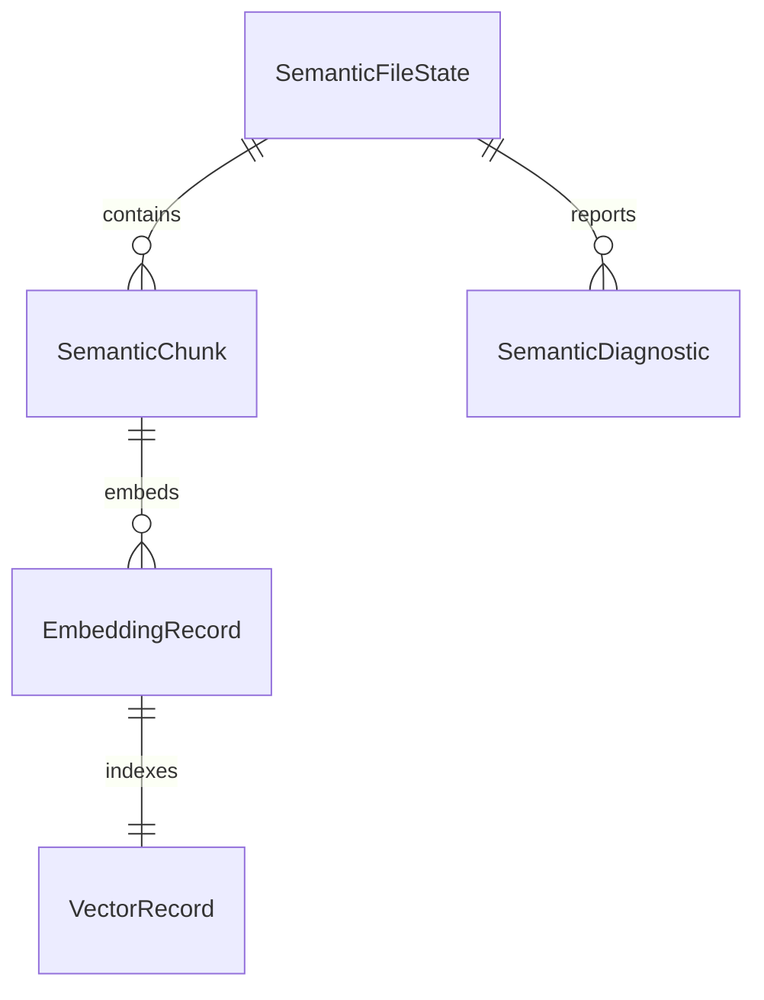
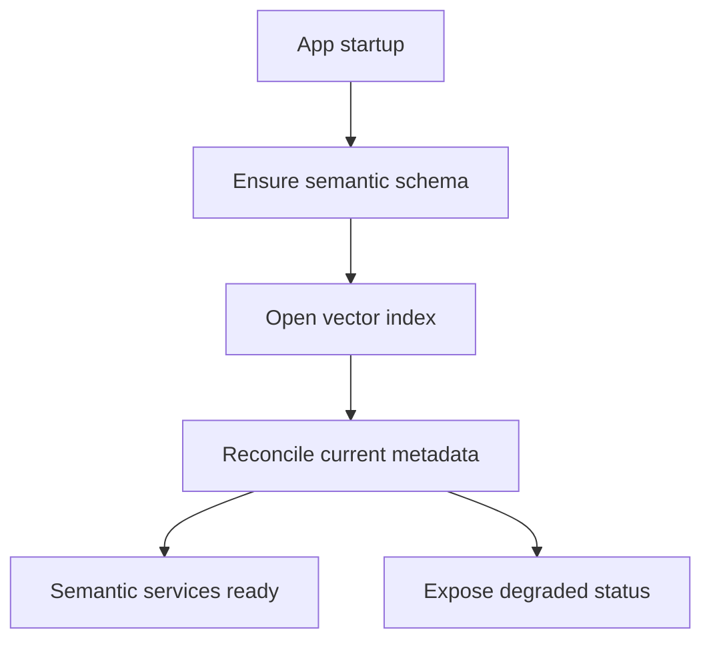

# Design Document

## Overview

This feature delivers the semantic retrieval core for Windows users who search local files by remembered meaning rather than filenames or exact keywords. It changes the current staged product by adding content chunk preparation, embedding generation, local vector persistence, query embedding, retrieval, ranking, and match explanation metadata.

The design is local-first and contract-first. It consumes provider-neutral `SemanticContentInput` records adapted from Content Extraction Pipeline `ExtractedContentPayload` records and Vision OCR Pipeline `VisualContentPayload` records, preserves `FileRecord` identity and canonical `sourceVersion` from the Local File Indexer, and returns ranked `SearchResult` values that the Desktop Search Shell already knows how to present. Provider and vector-store choices remain behind replaceable ports, while provider mode semantics are delegated to Privacy Performance Controls.

### Goals

- Generate traceable semantic chunks and embeddings from current text and visual semantic content inputs.
- Persist local vector records and freshness state across app restarts.
- Execute natural-language semantic retrieval with file-level ranking and grouping.
- Return result metadata and match context through the existing desktop shell contract.

### Non-Goals

- Crawl files, watch filesystem changes, or own file identity.
- Parse raw documents, run OCR, caption images, patch visual pipeline internals, or improve extraction quality.
- Build desktop UI components or change file open and reveal actions.
- Implement provider billing, cross-device sync, enterprise search, or privacy settings UI.

## Boundary Commitments

### This Spec Owns

- Provider-neutral semantic intake and semantic chunk records derived from current extracted or visual content.
- Embedding jobs, provider-neutral embedding requests, provider model metadata, policy adapter decisions, and retry status.
- Local vector index persistence, vector freshness state, stale invalidation, and removal from current search.
- Query embedding, vector retrieval, file-level grouping, ranking, and deterministic tie-breaking.
- A semantic search provider that returns shell-compatible `SearchResult` values with optional `MatchContext`.
- Aggregate semantic indexing readiness and diagnostic status.

### Out of Boundary

- Indexed roots, file records, file lifecycle jobs, deletion detection, and filesystem freshness owned by Local File Indexer.
- Parser selection, normalized extraction payloads, extraction statuses, and extracted-content reads owned by Content Extraction Pipeline.
- OCR, image captioning, visual tags, visual statuses, and visual payload reads owned by Vision OCR Pipeline.
- Desktop layout, result rendering, keyboard behavior, and open or reveal actions owned by Desktop Search Shell.
- Provider mode semantics, provider policy UI, folder exclusions, remote-processing controls, and resource throttling policy owned by Privacy Performance Controls.

### Allowed Dependencies

- Local File Indexer `FileRecord` identity and deletion or removal status.
- Content Extraction Pipeline `ExtractedContentReader` and Vision OCR Pipeline `VisualContentReader`, consumed only through semantic intake adapters.
- Desktop Search Shell `SearchProvider`, `SearchResult`, and `MatchContext` contracts.
- Local embedded persistence and a local vector index adapter that supports metadata-filtered similarity search.
- Embedding provider adapters only through the provider-neutral `EmbeddingProvider` contract and a thin `EmbeddingPolicyAdapter` over Privacy Performance Controls.

### Revalidation Triggers

- Changes to `ExtractedContentPayload`, `VisualContentPayload`, `SemanticContentInput`, `ChunkHint`, `SourceFileReference`, canonical `sourceVersion`, or intake query semantics.
- Changes to `SearchResult`, `MatchContext`, or `SearchProvider.search` contract shape.
- Changes to `SemanticChunk`, `EmbeddingRecord`, `VectorIndex`, `SemanticSearchResult`, or status values.
- Changes to Privacy Performance Controls provider policy semantics, vector dimensions, stale invalidation rules, or canonical `sourceVersion` handling.
- Changes that move parsing, OCR, file lifecycle, UI presentation, or provider settings into this spec boundary.

## Architecture

### Existing Architecture Analysis

The repository currently contains specifications rather than implementation. The Local File Indexer design supplies stable file identity, canonical `sourceVersion`, and lifecycle status. The Content Extraction Pipeline design supplies current normalized text payloads, parser-neutral metadata, and chunking hints. The Vision OCR Pipeline design supplies current visual text payloads and visual match metadata. The Desktop Search Shell design supplies the result presentation contract, including bounded `availabilityHint`, and excludes ranking and retrieval internals. Semantic Vector Search therefore fits as a downstream provider between semantic intake and shell presentation.

### Architecture Pattern & Boundary Map

**Architecture Integration**:
- Selected pattern: Ports and adapters around a semantic search domain core.
- Dependency direction: Shared types -> semantic intake and controls policy adapter -> repositories and vector ports -> chunking and embedding services -> indexing worker and query service -> shell provider adapter.
- Existing patterns preserved: local-first Windows MVP, staged spec boundaries, strong TypeScript contracts, and background work that does not block the shell.
- New components rationale: Chunking, embedding, vector storage, ranking, and shell adaptation are separate because each has different freshness, failure, and replacement constraints.



### Technology Stack

| Layer | Choice / Version | Role in Feature | Notes |
|-------|------------------|-----------------|-------|
| Desktop runtime | Tauri 2 | Hosts local background embedding and search services | Aligns with upstream shell |
| Application language | TypeScript 5 with Rust only for native/vector adapter needs | Defines semantic contracts, orchestration, ranking, and provider adapters | Public contracts must avoid `any` |
| Embeddings | Provider-neutral adapter | Generates content and query embeddings | Provider mode decisions come from Privacy Performance Controls |
| Data / Storage | Local embedded persistence plus local vector index adapter | Persists chunks, embeddings, vectors, freshness, and status | Physical engine selected during implementation |
| Background work | Local background worker | Processes ready semantic content inputs and retries embedding failures | No external queue required for MVP |

## File Structure Plan

### Directory Structure

```text
src/
├── semantic-search/
│   ├── types.ts                         # Shared chunk, embedding, vector, query, result, status, and error contracts
│   ├── semanticConfig.ts                # Chunk limits, ranking weights, policy adapter inputs, and batching defaults
│   ├── intake/
│   │   └── semanticContentIntake.ts     # Provider-neutral intake over extracted and visual content sources
│   ├── chunking/
│   │   ├── chunkingService.ts           # Converts extracted payloads and hints into stable semantic chunks
│   │   └── snippetBuilder.ts            # Produces safe match context from current chunk text and offsets
│   ├── embeddings/
│   │   ├── embeddingProvider.ts         # Provider-neutral embedding interface and model metadata contract
│   │   ├── embeddingPolicyAdapter.ts    # Thin adapter over Privacy Performance Controls decisions
│   │   └── embeddingService.ts          # Batching, provider calls, vector validation, and retryable embedding status
│   ├── indexing/
│   │   ├── semanticIndexWorker.ts       # Reads ready SemanticContentInput records and refreshes chunks, embeddings, and vectors
│   │   └── semanticFreshnessService.ts  # Marks stale, current, removed, failed, and policy-invalidated states
│   ├── retrieval/
│   │   ├── semanticQueryService.ts      # Embeds queries, retrieves current chunks, and returns ranked file results
│   │   ├── rankingService.ts            # Combines vector similarity, metadata signals, and deterministic tie-breaking
│   │   └── semanticSearchProvider.ts    # Implements the Desktop Search Shell SearchProvider contract
│   ├── repositories/
│   │   └── semanticRepository.ts        # Persistence contract for chunks, embedding records, freshness, and diagnostics
│   ├── vector/
│   │   ├── vectorIndex.ts               # Local vector index port for upsert, remove, search, and metadata filtering
│   │   └── localVectorIndex.ts          # Local vector index adapter selected during implementation
│   ├── status/
│   │   └── semanticStatusService.ts     # Aggregate semantic indexing readiness and failure counts
│   └── storage/
│       ├── semanticSchema.ts            # Schema and migration definitions for semantic records
│       └── localSemanticStore.ts        # Transactional local persistence adapter
tests/
└── semantic-vector-search/
    ├── chunking-service.test.ts
    ├── embedding-policy.test.ts
    ├── embedding-service.test.ts
    ├── semantic-index-worker.test.ts
    ├── semantic-query-service.test.ts
    ├── ranking-service.test.ts
    └── semantic-search-provider.test.ts
```

### Modified Files

- `src/search/SearchProvider.ts` or equivalent shell contract module -- import no semantic internals; only allow the semantic provider to implement the existing contract.
- `src/extraction/extractedContentReader.ts` and `src/vision/visualContentReader.ts` or equivalent upstream adapters -- no ownership change; semantic worker consumes both through `SemanticContentSource` adapters.
- `src/search/SearchProvider.ts` or equivalent shell contract module -- semantic provider maps partial indexing only to shell `availabilityHint`.
- Local storage migration entrypoint -- register semantic schema alongside indexer and extraction schemas when implementation introduces shared app storage.

## System Flows

### Semantic Content Input to Current Vectors



### Query to Shell Results



### Freshness State Flow



## Requirements Traceability

| Requirement | Summary | Components | Interfaces | Flows |
|-------------|---------|------------|------------|-------|
| 1.1 | Accept current extracted payloads | SemanticContentIntake, SemanticIndexWorker | SemanticContentInput | Semantic Content Input to Current Vectors |
| 1.2 | Accept current visual payloads | SemanticContentIntake, SemanticIndexWorker | SemanticContentInput | Semantic Content Input to Current Vectors |
| 1.3 | Accept limited usable payloads | SemanticContentIntake, SemanticRepository | SemanticContentInput | Semantic Content Input to Current Vectors |
| 1.4 | Exclude non-usable upstream states | SemanticContentIntake | SemanticContentSource | Semantic Content Input to Current Vectors |
| 1.5 | Preserve source identifiers | ChunkingService, SemanticRepository | SemanticChunk | Semantic Content Input to Current Vectors |
| 2.1 | Create semantic chunks | ChunkingService | SemanticChunk | Semantic Content Input to Current Vectors |
| 2.2 | Use chunking hints | ChunkingService | ChunkHint | Semantic Content Input to Current Vectors |
| 2.3 | Split oversized text | ChunkingService | ChunkingConfig | Semantic Content Input to Current Vectors |
| 2.4 | Record offsets and labels | ChunkingService, SnippetBuilder | SemanticChunk | Query to Shell Results |
| 2.5 | Stable chunk identifiers | ChunkingService | ChunkIdentity | Extracted Payload to Current Vectors |
| 3.1 | Provider-neutral embedding requests | EmbeddingService | EmbeddingProvider | Extracted Payload to Current Vectors |
| 3.2 | Local-first default policy | EmbeddingPolicyAdapter | PolicyDecision | Semantic Content Input to Current Vectors |
| 3.3 | Provider unavailable status | EmbeddingService, SemanticRepository | EmbeddingError | Freshness State Flow |
| 3.4 | Store vector model metadata | EmbeddingService, VectorIndex | EmbeddingRecord | Semantic Content Input to Current Vectors |
| 3.5 | Policy regeneration decisions | SemanticFreshnessService, EmbeddingPolicyAdapter | PolicyImpactPlan | Freshness State Flow |
| 4.1 | Persist vectors and metadata | VectorIndex, SemanticRepository | VectorRecord | Semantic Content Input to Current Vectors |
| 4.2 | Recover after restart | LocalSemanticStore, LocalVectorIndex | SemanticIndexState | Freshness State Flow |
| 4.3 | Remove deleted content from current results | SemanticFreshnessService, VectorIndex | SemanticFreshnessState | Freshness State Flow |
| 4.4 | Block stale vectors | SemanticQueryService, VectorIndex | VectorSearchFilter | Query to Shell Results |
| 4.5 | Expose freshness without raw content | SemanticStatusService | SemanticStatusSnapshot | Freshness State Flow |
| 5.1 | Embed non-empty query | SemanticQueryService, EmbeddingService | SemanticQuery | Query to Shell Results |
| 5.2 | Retrieve similar current chunks | SemanticQueryService, VectorIndex | VectorSearchResult | Query to Shell Results |
| 5.3 | Empty set when vectors unavailable | SemanticQueryService | SearchError | Query to Shell Results |
| 5.4 | Query embedding failure | SemanticSearchProvider | SearchError | Query to Shell Results |
| 5.5 | Ignore unavailable vectors | SemanticQueryService, VectorIndex | VectorSearchFilter | Query to Shell Results |
| 6.1 | Group chunks by file | RankingService | FileResultCandidate | Query to Shell Results |
| 6.2 | Rank by similarity and metadata | RankingService | RankingSignals | Query to Shell Results |
| 6.3 | Prefer current versions | RankingService, SemanticRepository | sourceVersion | Query to Shell Results |
| 6.4 | Deterministic tie-breaking | RankingService | RankingPolicy | Query to Shell Results |
| 6.5 | Return ranked shell results | SemanticSearchProvider | SearchResult | Query to Shell Results |
| 7.1 | Include shell-required fields | SemanticSearchProvider | SearchResult | Query to Shell Results |
| 7.2 | Include match context | SnippetBuilder, SemanticSearchProvider | MatchContext | Query to Shell Results |
| 7.3 | Include partial indexing metadata safely | SemanticSearchProvider | availabilityHint | Query to Shell Results |
| 7.4 | Avoid fabricated snippets | SnippetBuilder | MatchContext | Query to Shell Results |
| 7.5 | Avoid UI ownership | SemanticSearchProvider | SearchProvider | Query to Shell Results |
| 8.1 | Mark changed content stale | SemanticFreshnessService | SemanticFreshnessState | Freshness State Flow |
| 8.2 | Mark refreshed content current | SemanticIndexWorker, SemanticFreshnessService | SemanticFreshnessState | Freshness State Flow |
| 8.3 | Retain failure and retry status | EmbeddingService, SemanticRepository | SemanticDiagnostic | Freshness State Flow |
| 8.4 | Avoid shell blocking | SemanticIndexWorker | Background worker | Semantic Content Input to Current Vectors |
| 8.5 | Provide aggregate status counts | SemanticStatusService | SemanticStatusSnapshot | Freshness State Flow |

## Components and Interfaces

| Component | Domain/Layer | Intent | Req Coverage | Key Dependencies | Contracts |
|-----------|--------------|--------|--------------|------------------|-----------|
| SemanticContentIntake | Application | Normalize extracted and visual payloads into one semantic input stream | 1.1, 1.2, 1.3, 1.4, 1.5 | ExtractedContentReader P0, VisualContentReader P0 | Service |
| SemanticIndexWorker | Runtime | Refresh semantic records from ready semantic content inputs in the background | 1.1, 1.2, 1.3, 1.5, 8.2, 8.4 | SemanticContentIntake P0, ChunkingService P0, EmbeddingService P0 | Batch, Service |
| ChunkingService | Domain | Create stable semantic chunks from semantic content inputs and hints | 1.4, 2.1, 2.2, 2.3, 2.4, 2.5 | SemanticContentInput P0 | Service |
| SnippetBuilder | Domain | Produce safe human-readable match context | 2.4, 7.2, 7.4 | SemanticChunk P0 | Service |
| EmbeddingPolicyAdapter | Adapter | Converts content and query embedding requests into Privacy Performance Controls decisions | 3.2, 3.5 | PolicyDecisionService P1 | Service, State |
| EmbeddingService | Application | Generate content and query embeddings through provider-neutral adapters | 3.1, 3.3, 3.4, 5.1, 5.4, 8.3 | EmbeddingProvider P0, EmbeddingPolicyAdapter P0 | Service |
| EmbeddingProvider | Adapter Port | Provide vectors for text batches and queries | 3.1, 3.4 | Local or remote provider adapter P0 | Service |
| SemanticFreshnessService | Application | Apply stale, current, removed, failed, and invalidated state transitions | 3.5, 4.3, 8.1, 8.2 | SemanticRepository P0, VectorIndex P0 | Service, State |
| SemanticRepository | Data | Persist chunks, embedding metadata, freshness state, and diagnostics | 1.2, 1.4, 3.3, 3.4, 8.3 | LocalSemanticStore P0 | State |
| VectorIndex | Data Port | Store vectors and perform metadata-filtered similarity search | 4.1, 4.2, 4.4, 5.2, 5.5 | LocalVectorIndex P0 | Service, State |
| SemanticQueryService | Application | Embed queries, retrieve matching chunks, and coordinate ranking | 4.4, 5.1, 5.2, 5.3, 5.5 | EmbeddingService P0, VectorIndex P0, RankingService P0 | Service |
| RankingService | Domain | Group chunk matches into ranked file-level results | 6.1, 6.2, 6.3, 6.4 | SemanticRepository P0 | Service |
| SemanticSearchProvider | Provider | Implement shell `SearchProvider` using semantic query results | 5.4, 6.5, 7.1, 7.3, 7.5 | SemanticQueryService P0 | Service |
| SemanticStatusService | Application | Expose aggregate semantic readiness and diagnostic counts | 4.5, 8.5 | SemanticRepository P0, VectorIndex P0 | Service, State |

### Shared Types

```typescript
type Result<T, E> =
  | { ok: true; value: T }
  | { ok: false; error: E };

type SemanticFreshnessState =
  | "pending"
  | "chunked"
  | "embedding"
  | "current"
  | "stale"
  | "failed"
  | "removed"
  | "policyInvalidated";

type ProviderMode = "localOnly" | "remoteAllowed" | "hybrid";
type SemanticContentSourceKind = "extractedText" | "visualText";
type CanonicalFileType = "document" | "text" | "code" | "image" | "unknown";

interface SemanticContentInput {
  sourceId: string;
  sourceKind: SemanticContentSourceKind;
  fileId: string;
  rootId: string;
  path: string;
  displayName: string;
  fileType: CanonicalFileType;
  extension?: string;
  sourceVersion: string;
  upstreamArtifactId: string;
  text: string;
  limited: boolean;
  chunkHints: ChunkHint[];
  metadata: Record<string, string | number | boolean>;
}

interface SemanticChunk {
  chunkId: string;
  fileId: string;
  sourceId: string;
  sourceKind: SemanticContentSourceKind;
  upstreamArtifactId: string;
  sourceVersion: string;
  ordinal: number;
  text: string;
  startOffset: number;
  endOffset: number;
  label?: string;
  limited: boolean;
}

interface EmbeddingModelMetadata {
  providerId: string;
  modelId: string;
  dimensions: number;
  providerMode: ProviderMode;
}

interface EmbeddingRecord {
  embeddingId: string;
  chunkId: string;
  fileId: string;
  sourceId: string;
  sourceKind: SemanticContentSourceKind;
  upstreamArtifactId: string;
  sourceVersion: string;
  model: EmbeddingModelMetadata;
  freshness: SemanticFreshnessState;
  failureReason?: string;
  updatedAt: string;
}

interface VectorSearchMatch {
  chunkId: string;
  fileId: string;
  score: number;
  sourceVersion: string;
}

interface SemanticStatusSnapshot {
  overall: "notReady" | "working" | "current" | "degraded";
  pendingChunks: number;
  currentFiles: number;
  staleFiles: number;
  failedFiles: number;
  removedFiles: number;
}
```

Semantic intake preserves the Local File Indexer distinction between `extension` and `fileType`: `extension` is a normalized suffix for display/parser hints, while `fileType` is the canonical broad classification used for routing and ranking metadata.

### Application Layer

#### SemanticContentIntake

| Field | Detail |
|-------|--------|
| Intent | Provide one semantic-ready input stream from extracted text and visual text sources |
| Requirements | 1.1, 1.2, 1.3, 1.4, 1.5 |

**Responsibilities & Constraints**
- Adapt `ExtractedContentPayload` and `VisualContentPayload` into `SemanticContentInput`.
- Preserve canonical `sourceVersion`, `fileId`, source kind, and upstream artifact ID.
- Exclude unsupported, empty, failed, pending, stale, removed, and policy-blocked upstream records.
- Avoid importing parser or visual processor internals.

**Contracts**: Service [x] / API [ ] / Event [ ] / Batch [x] / State [ ]

```typescript
interface SemanticContentIntake {
  listReadyInputs(limit: number): Promise<Result<SemanticContentInput[], SemanticIndexError>>;
}
```

#### SemanticIndexWorker

| Field | Detail |
|-------|--------|
| Intent | Convert ready semantic content inputs into current semantic chunks and vectors without blocking the shell |
| Requirements | 1.1, 1.2, 1.3, 1.5, 8.2, 8.4 |

**Responsibilities & Constraints**
- Poll or receive ready `SemanticContentInput` records from semantic intake.
- Skip unsupported, empty, failed, pending, stale, policy-blocked, and removed upstream states.
- Persist chunk state before embedding so failed provider calls remain retryable.
- Mark only the current canonical `sourceVersion` as current after vector upsert succeeds.

**Contracts**: Service [x] / API [ ] / Event [ ] / Batch [x] / State [ ]

```typescript
interface SemanticIndexWorker {
  processReadyPayloads(limit: number): Promise<Result<SemanticIndexBatchSummary, SemanticIndexError>>;
  refreshFile(fileId: string, sourceVersion: string): Promise<Result<SemanticRefreshSummary, SemanticIndexError>>;
}
```

#### EmbeddingService

| Field | Detail |
|-------|--------|
| Intent | Generate vectors for chunks and queries through a policy-checked provider port |
| Requirements | 3.1, 3.2, 3.3, 3.4, 5.1, 5.4, 8.3 |

**Responsibilities & Constraints**
- Ask `EmbeddingPolicyAdapter` for a Privacy Performance Controls decision before sending content or query text to a provider.
- Batch chunk embedding requests when provider limits allow.
- Validate vector dimensions against provider metadata.
- Return retryable provider errors without mutating existing current vectors.

**Contracts**: Service [x] / API [ ] / Event [ ] / Batch [ ] / State [ ]

```typescript
interface EmbeddingService {
  embedChunks(chunks: SemanticChunk[]): Promise<Result<EmbeddingRecord[], SemanticEmbeddingError>>;
  embedQuery(query: SemanticQuery): Promise<Result<QueryEmbedding, SemanticEmbeddingError>>;
}
```

#### EmbeddingPolicyAdapter

| Field | Detail |
|-------|--------|
| Intent | Keep semantic embedding policy aligned with Privacy Performance Controls |
| Requirements | 3.2, 3.5 |

**Responsibilities & Constraints**
- Convert content embedding and query embedding requests into controls `PolicyWorkRequest` values.
- Consume shared `ProviderMode = "localOnly" | "remoteAllowed" | "hybrid"` decisions from Privacy Performance Controls.
- Consume controls impact plans for regeneration or invalidation after provider policy changes.
- Avoid defining independent local/remote/hybrid semantics inside Semantic Vector Search.

**Contracts**: Service [x] / API [ ] / Event [ ] / Batch [ ] / State [x]

#### SemanticQueryService

| Field | Detail |
|-------|--------|
| Intent | Execute natural-language semantic search against current local vectors |
| Requirements | 4.4, 5.1, 5.2, 5.3, 5.5 |

**Responsibilities & Constraints**
- Reject empty or whitespace-only queries before provider calls.
- Use current provider policy for query embedding.
- Filter vector search to current, non-removed, non-invalidated canonical `sourceVersion` values.
- Return a shell-compatible empty `SearchResponse` with query-level not-ready metadata when the vector index has no current searchable vectors.

**Contracts**: Service [x] / API [ ] / Event [ ] / Batch [ ] / State [ ]

```typescript
interface SemanticQueryService {
  search(query: SemanticQuery): Promise<Result<SemanticSearchResult[], SemanticSearchError>>;
}
```

#### SemanticSearchProvider

| Field | Detail |
|-------|--------|
| Intent | Adapt semantic search results into the Desktop Search Shell provider contract |
| Requirements | 5.4, 6.5, 7.1, 7.3, 7.5 |

**Responsibilities & Constraints**
- Return shell-compatible `SearchResult` values in ranked order.
- Preserve path, display name, file type, rank, action eligibility, and bounded `availabilityHint` where partial indexing applies.
- Convert provider failures into normalized `SearchError` values when the query cannot be evaluated; use query-level `SearchResponse.readiness` for empty not-ready states that are not exceptional errors.
- Avoid exposing vector database, embedding model, or pipeline internals in UI-facing fields.
- Map partial or limited per-result semantic state only to Desktop Search Shell `availabilityHint` reasons: `indexingPending`, `contentLimited`, `visualLimited`, `providerLimited`, `notIndexedYet`, `providerUnavailable`, or `policyBlocked`. Map empty not-ready query state to `SearchResponse.readiness`.

**Contracts**: Service [x] / API [ ] / Event [ ] / Batch [ ] / State [ ]

### Domain Layer

#### ChunkingService

| Field | Detail |
|-------|--------|
| Intent | Produce stable, traceable semantic chunks from extracted content |
| Requirements | 1.4, 2.1, 2.2, 2.3, 2.4, 2.5 |

**Responsibilities & Constraints**
- Use extraction chunking hints before fallback chunk boundaries.
- Preserve offsets, labels, ordinals, upstream artifact ID, file ID, source kind, and canonical `sourceVersion`.
- Generate deterministic chunk IDs from stable canonical `sourceVersion`, source kind, upstream artifact ID, and boundary data.
- Respect maximum chunk size and overlap configuration.

**Contracts**: Service [x] / API [ ] / Event [ ] / Batch [ ] / State [ ]

```typescript
interface ChunkingService {
  createChunks(input: SemanticContentInput): Result<SemanticChunk[], ChunkingError>;
}
```

#### RankingService

| Field | Detail |
|-------|--------|
| Intent | Convert chunk matches into deterministic file-level ranking |
| Requirements | 6.1, 6.2, 6.3, 6.4 |

**Responsibilities & Constraints**
- Group vector matches by file ID.
- Use best-match score, supporting chunk count, file metadata, recency when available, and limited-content status as ranking signals.
- Prefer current canonical `sourceVersion` values and exclude stale records.
- Apply deterministic tie-breaking by score, file display name, path, and stable file ID.

**Contracts**: Service [x] / API [ ] / Event [ ] / Batch [ ] / State [ ]

#### SnippetBuilder

| Field | Detail |
|-------|--------|
| Intent | Build safe, human-readable match context for shell results |
| Requirements | 2.4, 7.2, 7.4 |

**Responsibilities & Constraints**
- Build snippets only from current chunk text or validated offsets.
- Avoid fabricating explanation text when usable context is unavailable.
- Preserve human-readable labels when available.

**Contracts**: Service [x] / API [ ] / Event [ ] / Batch [ ] / State [ ]

### Data and Adapter Layer

#### VectorIndex

| Field | Detail |
|-------|--------|
| Intent | Persist and search local vectors through a replaceable adapter |
| Requirements | 4.1, 4.2, 4.4, 5.2, 5.5 |

**Responsibilities & Constraints**
- Upsert vectors with chunk, file, canonical `sourceVersion`, model, and freshness metadata.
- Remove or tombstone vectors for deleted, removed, stale, and policy-invalidated sources.
- Support top-k similarity search with metadata filters for current vectors.
- Recover index metadata after app restart.

**Contracts**: Service [x] / API [ ] / Event [ ] / Batch [ ] / State [x]

```typescript
interface VectorIndex {
  upsert(records: VectorRecord[]): Promise<Result<void, VectorIndexError>>;
  markUnavailable(filter: VectorInvalidationFilter): Promise<Result<void, VectorIndexError>>;
  search(request: VectorSearchRequest): Promise<Result<VectorSearchMatch[], VectorIndexError>>;
  getStats(): Promise<Result<VectorIndexStats, VectorIndexError>>;
}
```

#### SemanticRepository

| Field | Detail |
|-------|--------|
| Intent | Persist semantic chunks, embedding records, freshness state, and diagnostics |
| Requirements | 1.2, 1.4, 3.3, 3.4, 8.3 |

**Responsibilities & Constraints**
- Store semantic records transactionally with canonical `sourceVersion` guards.
- Maintain current pointers separate from historical or stale records.
- Retain failure reasons and retry state for diagnostics.
- Provide read models needed by ranking and status services.

**Contracts**: Service [ ] / API [ ] / Event [ ] / Batch [ ] / State [x]

## Data Models

### Domain Model

- `SemanticFileState` is the aggregate root for one file's semantic index state.
- `SemanticContentInput` is the provider-neutral intake record for extracted text and visual text.
- `SemanticChunk` belongs to one upstream artifact, one source kind, and one source file.
- `EmbeddingRecord` belongs to one chunk and one provider model configuration.
- `VectorRecord` mirrors searchable embeddings in the vector index and carries metadata filters.
- `SemanticDiagnostic` records retryable and non-retryable failures without storing raw full-file content.



### Logical Data Model

- Natural current key: `fileId + sourceVersion + sourceKind + upstreamArtifactId + providerId + modelId`.
- Stable chunk key: `fileId + sourceVersion + sourceKind + upstreamArtifactId + ordinal + startOffset + endOffset`.
- Vector search filters must include `freshness = current`, provider model compatibility, and canonical `sourceVersion` currentness.
- Current state transitions are transactional across repository records and vector availability flags where the selected storage engine supports it. If not, reconciliation must repair mismatches during startup.

### Data Contracts & Integration

- Input: `SemanticContentInput` records adapted from extraction and vision, including `fileId`, canonical `sourceVersion`, `sourceKind`, upstream artifact ID, normalized searchable `text`, metadata, and optional `chunkHints`.
- Output: `SearchResult` for shell presentation, including required file fields, optional `MatchContext`, and optional bounded `availabilityHint`.
- Status: `SemanticStatusSnapshot` for readiness and diagnostics, never raw full-file contents.

## Error Handling

### Error Strategy

- Provider policy errors fail before text leaves the local process and are based on Privacy Performance Controls decisions.
- Provider unavailable errors are retryable for content embedding and provider-unavailable for query search.
- Vector storage errors mark affected files degraded while leaving previously current vectors untouched unless invalidation is required.
- Stale canonical `sourceVersion` conflicts reject in-flight output and schedule refresh for the latest version.

### Error Categories and Responses

- **Input errors**: Empty queries and non-usable semantic intake states are rejected without provider calls.
- **Provider errors**: Missing model, timeout, unavailable provider, dimension mismatch, or policy denial are normalized into `SemanticEmbeddingError`.
- **Storage errors**: Vector upsert, search, or metadata persistence failures are recorded with retry status.
- **State conflicts**: Stale canonical `sourceVersion` values never replace current semantic state.

### Monitoring

- Record semantic job counts, provider failures, vector index failures, stale file counts, and average query latency as local diagnostics.
- Expose aggregate counts through `SemanticStatusService` for readiness and troubleshooting.

## Testing Strategy

### Unit Tests

- Verify chunking respects extraction hints, stable IDs, offsets, oversized text splitting, and limited payload metadata.
- Verify `EmbeddingPolicyAdapter` delegates remote-provider decisions to Privacy Performance Controls and marks policy-invalidated embeddings when controls impact plans require it.
- Verify ranking groups chunks by file, combines score and metadata signals, and applies deterministic tie-breaking.
- Verify snippet building returns safe chunk context and omits fabricated text when no valid context exists.

### Integration Tests

- Process ready semantic content inputs into chunk records, embedding metadata, vector records, and current semantic state.
- Recover persisted chunks, embeddings, vector metadata, and freshness status after simulated restart.
- Mark deleted, removed, stale, and policy-invalidated vectors unavailable and exclude them from retrieval.
- Convert provider and storage failures into retryable diagnostics without deleting existing current vectors.

### E2E / Provider Contract Tests

- Submit a natural-language query and receive shell-compatible ranked `SearchResult` values with match context.
- Verify limited extracted and visual inputs map to bounded `availabilityHint` values without exposing semantic internals.
- Return not-ready empty status when no current vectors exist.
- Return provider-unavailable error when query embedding fails.
- Verify the desktop shell result contract does not expose embedding or vector internals.

### Performance

- Measure chunking and embedding batch behavior on representative extracted payload sizes.
- Measure top-k vector search latency against expected MVP local index sizes.
- Verify background embedding does not block shell query submission or result rendering.

## Security Considerations

- Source text remains local by default and may only be sent to a remote embedding provider after Privacy Performance Controls explicitly permits it for the requested modality and shared `ProviderMode`.
- Persisted semantic records should avoid duplicating full raw documents; only chunk text and match context material needed for retrieval and explanation are retained.
- Status snapshots and shell-facing results must not include provider secrets, raw vector values, or internal storage details.

## Migration Strategy



- Initial implementation creates semantic tables and vector index storage only when semantic search is enabled.
- Startup reconciliation compares repository current pointers with vector index availability and marks mismatches stale or degraded.
- Rollback removes semantic search provider wiring while leaving indexer and extraction state untouched.
