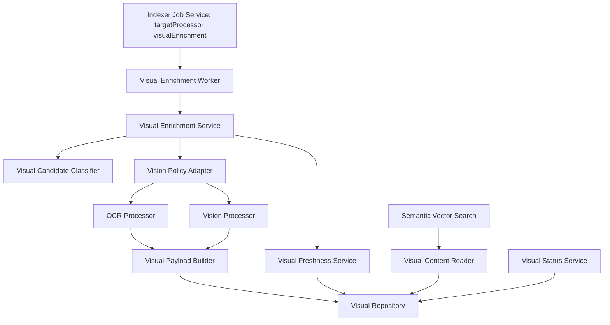
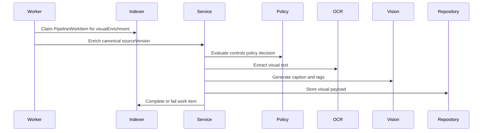
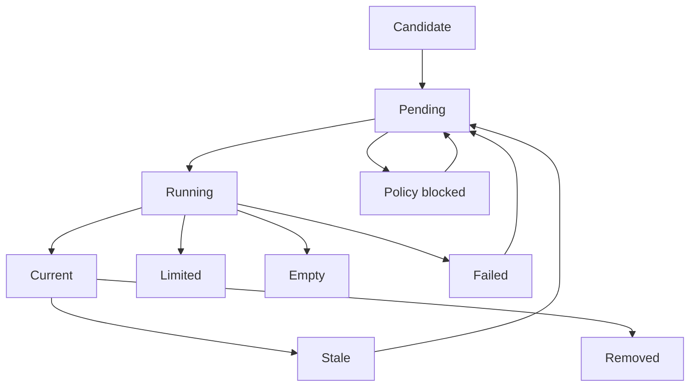
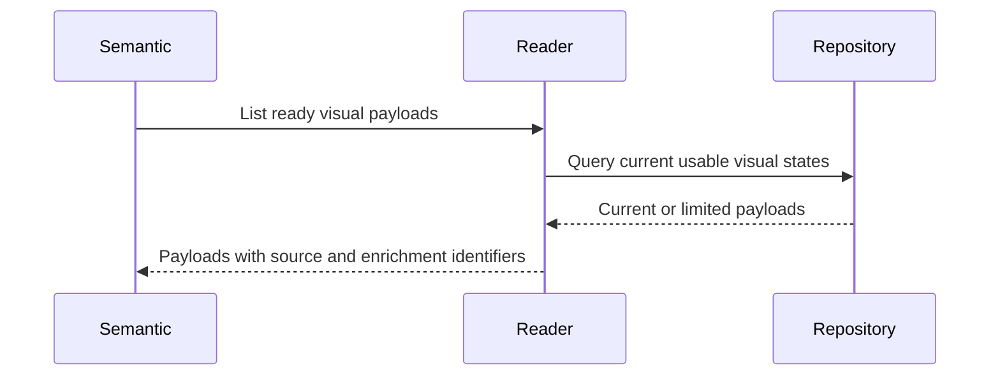

# Design Document

## Overview

This feature delivers visual enrichment for Windows users who want screenshots, scanned documents, and photos to be discoverable by visible text and visual meaning. It changes the staged product by adding OCR, caption generation, generated non-biometric tags, normalized visual payloads, confidence metadata, and ready-for-embedding reads for Semantic Vector Search.

The design is local-first and contract-first. It consumes stable file identity, canonical `sourceVersion`, and `PipelineWorkItem` records with `targetProcessor = "visualEnrichment"` from Local File Indexer, avoids born-digital text extraction owned by Content Extraction Pipeline, and exposes current visual content payloads through provider-neutral Semantic Vector Search intake that can later present through the Desktop Search Shell result contract.

### Goals

- Extract normalized OCR text from screenshots, scanned documents, and image-like files.
- Generate concise captions and non-biometric tags for visual files.
- Persist current, stale, failed, empty, limited, and policy-blocked visual enrichment state.
- Expose ready visual payloads and match-context metadata to Semantic Vector Search without owning embeddings or result rendering.

### Non-Goals

- Crawl files, watch folders, or own file identity.
- Parse born-digital PDFs, DOCX, text, Markdown, notes, or code.
- Generate embeddings, store vectors, rank results, or implement semantic retrieval.
- Build desktop UI components, preview panes, image editing, photo management, manual tags, face recognition, biometric identification, cloud albums, or provider settings UI.

## Boundary Commitments

### This Spec Owns

- Intake of eligible image-like files and scanned-document candidates from indexer-owned file and `PipelineWorkItem` contracts.
- OCR text generated from visual pixels, including region/page labels and confidence metadata when available.
- Captions and non-biometric generated tags for visual semantic search.
- Normalized `VisualContentPayload` records, visual enrichment status, error metadata, source/enrichment versioning, and current payload pointers.
- Provider-neutral OCR and vision adapter contracts, thin provider-policy adapter behavior, and visual processing queue behavior.
- `VisualContentReader` read contracts that expose current visual payloads and ready-for-embedding lists.
- Aggregate visual enrichment status counts for diagnostics and indexing transparency.

### Out of Boundary

- File discovery, indexed roots, file metadata ownership, deletion detection, durable base `FileChangeEvent`, and derived `PipelineWorkItem` creation owned by Local File Indexer.
- Born-digital document text extraction and parser-neutral document payloads owned by Content Extraction Pipeline.
- Chunking for semantic retrieval, embedding generation, vector persistence, query embedding, ranking, and shell-compatible result construction owned by Semantic Vector Search.
- Desktop result rendering, file open/reveal actions, and keyboard workflow owned by Desktop Search Shell.
- Folder exclusions UI, AI provider settings UI, remote-processing consent UI, provider mode semantics, and resource-control policy owned by Privacy Performance Controls.

### Allowed Dependencies

- Local File Indexer `FileRecord`, canonical `sourceVersion`, lifecycle status, and `PipelineWorkItem` claim/complete/fail contracts.
- Content Extraction Pipeline only for boundary coordination around born-digital text ownership; no direct parser dependency is required.
- Semantic Vector Search through a ready visual payload reader contract.
- Desktop Search Shell only through established `SearchResult` and `MatchContext` semantics used downstream.
- Local embedded persistence for visual records, payloads, statuses, current pointers, and diagnostics.
- Provider-neutral local or remote OCR and vision adapters governed by Privacy Performance Controls decisions through a thin `VisionPolicyAdapter`.

### Revalidation Triggers

- Changes to `FileRecord`, `PipelineWorkItem`, `targetProcessor`, canonical `sourceVersion` shape, or deletion/removal handling.
- Changes to `VisualContentPayload`, `VisualSignal`, status values, confidence model, or ready-for-embedding query semantics.
- Changes to Privacy Performance Controls provider policy semantics, local/remote default behavior, retry states, or throttling status.
- Changes that move born-digital text extraction, embeddings, vector storage, retrieval ranking, UI presentation, or privacy settings into this spec boundary.
- Changes to `SearchResult` or `MatchContext` that affect how visual OCR, captions, or tags can explain results downstream.

## Architecture

### Existing Architecture Analysis

The upstream specs define clear staged ownership. Local File Indexer supplies stable file identity, source metadata, canonical `sourceVersion`, durable `PipelineWorkItem` records, deletion state, and freshness signals. Content Extraction Pipeline owns born-digital parser output and excludes OCR and image captioning. Semantic Vector Search owns chunking, embeddings, local vector search, ranking, result context conversion, and provider-neutral semantic intake. Desktop Search Shell owns rendering and file actions. Privacy Performance Controls owns provider mode semantics. This design adds a parallel visual enrichment domain between indexer work items and semantic intake reads.

### Architecture Pattern & Boundary Map

**Architecture Integration**:
- Selected pattern: Local worker pipeline with provider ports and payload-reader adapter.
- Dependency direction: Types and config -> controls policy adapter -> processor adapters -> normalization -> repository -> enrichment service -> worker and reader adapters -> downstream semantic search.
- Existing patterns preserved: local-first Windows MVP, user-approved file scope, background work that does not block the shell, strong TypeScript contracts, and replaceable provider adapters.
- New components rationale: OCR, captioning, tagging, freshness, status, and ready-payload reads have distinct failure and boundary concerns, but share one normalized visual payload.



### Technology Stack

| Layer | Choice / Version | Role in Feature | Notes |
|-------|------------------|-----------------|-------|
| Desktop runtime | Tauri 2 | Hosts local background visual enrichment in the desktop app process | Aligns with upstream shell |
| Application language | TypeScript 5 with Rust only for native image or OCR bindings if needed | Shared contracts, orchestration, provider adapters, and status services | Public contracts must avoid `any` |
| OCR and vision | Provider-neutral adapters | Extract OCR text, captions, and generated tags | Concrete engines selected during implementation under local-first policy |
| Data / Storage | Local embedded persistence | Persists visual records, payloads, statuses, current pointers, and diagnostics | Must support transactional current-pointer updates |
| Work items | Local indexer `PipelineWorkItem` lifecycle plus visual queue state | Runs expensive processing asynchronously and recoverably | No external queue required for MVP |

## File Structure Plan

### Directory Structure

```text
src/
├── vision/
│   ├── types.ts                         # Visual status, payload, signal, provider, error, and reader contracts
│   ├── visionConfig.ts                  # Supported visual types, limits, confidence thresholds, and batch defaults
│   ├── candidateClassifier.ts           # Accepts image-like files and scanned-document candidates from file metadata
│   ├── visionPolicyAdapter.ts           # Thin adapter over Privacy Performance Controls provider and resource decisions
│   ├── visualEnrichmentService.ts       # Coordinates candidate validation, provider calls, normalization, persistence, and job settlement
│   ├── visualEnrichmentWorker.ts        # Claims visual enrichment work and runs within queue and throttle constraints
│   ├── visualFreshnessService.ts        # Applies current, stale, removed, failed, and policy-blocked state transitions
│   ├── visualStatusService.ts           # Builds aggregate visual enrichment readiness and diagnostic counts
│   ├── visualContentReader.ts           # Downstream read interface for current payloads and ready-for-embedding lists
│   ├── processing/
│   │   ├── ocrProcessor.ts              # OCR adapter interface and local/remote processor result envelope
│   │   ├── visionProcessor.ts           # Caption and generated tag adapter interface
│   │   └── visualPayloadBuilder.ts      # Combines OCR, captions, tags, confidence, and labels into payloads
│   ├── repositories/
│   │   └── visualRepository.ts          # Persistence contract for visual records, payloads, errors, and current pointers
│   └── storage/
│       ├── visualSchema.ts              # Schema and migration definitions for visual enrichment records
│       └── localVisualStore.ts          # Transactional local persistence adapter
tests/
└── vision-ocr-pipeline/
    ├── candidate-classifier.test.ts
    ├── provider-policy.test.ts
    ├── visual-payload-builder.test.ts
    ├── visual-enrichment-service.test.ts
    ├── visual-worker-recovery.test.ts
    └── visual-content-reader.test.ts
```

### Modified Files

- `src/indexer/jobService.ts` or equivalent future indexer adapter -- expose or route visual enrichment work only through `claimNextWorkItem("visualEnrichment", workerId)`, `completeWorkItem`, and `failWorkItem`.
- `src/semantic-search/intake/semanticContentIntake.ts` or equivalent future semantic intake adapter -- consume `VisualContentReader` as an additional `SemanticContentSource` without changing vector ownership.
- Local storage migration entrypoint -- register visual schema alongside indexer, extraction, and semantic schemas when shared app storage exists.

## System Flows

### Visual Candidate to Current Payload



### Visual Freshness State Flow



### Ready Visual Payload Read



## Requirements Traceability

| Requirement | Summary | Components | Interfaces | Flows |
|-------------|---------|------------|------------|-------|
| 1.1 | Accept image-like files | CandidateClassifier, VisualEnrichmentWorker | VisualCandidate | Visual Candidate to Current Payload |
| 1.2 | Accept scanned-document candidates | CandidateClassifier | VisualCandidate | Visual Candidate to Current Payload |
| 1.3 | Exclude ineligible files | CandidateClassifier, VisualEnrichmentService | CandidateDecision | Visual Freshness State Flow |
| 1.4 | Preserve source traceability | VisualPayloadBuilder, VisualRepository | SourceVisualReference | Ready Visual Payload Read |
| 1.5 | Avoid independent discovery | VisualEnrichmentWorker | Indexer job adapter | Visual Candidate to Current Payload |
| 2.1 | OCR screenshots and images | OCRProcessor, VisualPayloadBuilder | OCRSignal | Visual Candidate to Current Payload |
| 2.2 | OCR scanned documents | OCRProcessor, VisualPayloadBuilder | OCRSignal | Visual Candidate to Current Payload |
| 2.3 | Preserve text ordering and labels | OCRProcessor, VisualPayloadBuilder | OCRRegion | Visual Candidate to Current Payload |
| 2.4 | Empty OCR status | VisualPayloadBuilder, VisualRepository | VisualStatus | Visual Freshness State Flow |
| 2.5 | Distinguish visual text | VisualPayloadBuilder | VisualModality | Ready Visual Payload Read |
| 3.1 | Generate captions | VisionProcessor, VisualPayloadBuilder | CaptionSignal | Visual Candidate to Current Payload |
| 3.2 | Generate non-biometric tags | VisionProcessor, VisualPayloadBuilder | TagSignal | Visual Candidate to Current Payload |
| 3.3 | Preserve low-confidence captions | VisualPayloadBuilder, VisualRepository | ConfidenceMetadata | Visual Freshness State Flow |
| 3.4 | Preserve low-confidence tag handling | VisualPayloadBuilder, VisualRepository | ConfidenceMetadata | Visual Freshness State Flow |
| 3.5 | Avoid biometric identification | VisionProcessor, VisionPolicyAdapter | PolicyDecision | Visual Candidate to Current Payload |
| 4.1 | Expose normalized payloads | VisualRepository, VisualContentReader | VisualContentPayload | Ready Visual Payload Read |
| 4.2 | Include payload fields | VisualPayloadBuilder | VisualContentPayload | Ready Visual Payload Read |
| 4.3 | Preserve context labels and offsets | VisualPayloadBuilder | VisualSignal | Ready Visual Payload Read |
| 4.4 | Expose partial statuses safely | VisualRepository, VisualStatusService | VisualDiagnostic | Visual Freshness State Flow |
| 4.5 | Expose only current payloads | VisualContentReader | ReadyVisualPayloadQuery | Ready Visual Payload Read |
| 5.1 | Local-first default | VisionPolicyAdapter | PolicyDecision | Visual Candidate to Current Payload |
| 5.2 | Honor allowed remote policy | VisionPolicyAdapter | PolicyDecision | Visual Candidate to Current Payload |
| 5.3 | Block unpermitted remote processing | VisionPolicyAdapter, VisualEnrichmentService | PolicyDecision | Visual Freshness State Flow |
| 5.4 | Determine policy invalidation | VisualFreshnessService, VisionPolicyAdapter | PolicyImpactPlan | Visual Freshness State Flow |
| 5.5 | Retain safe provider diagnostics | VisualStatusService | VisualStatusSnapshot | Visual Freshness State Flow |
| 6.1 | Queue enrichment | VisualEnrichmentWorker | VisualQueueState | Visual Candidate to Current Payload |
| 6.2 | Avoid shell blocking | VisualEnrichmentWorker | Worker runtime | Visual Candidate to Current Payload |
| 6.3 | Mark changed source stale | VisualFreshnessService | VisualFreshnessState | Visual Freshness State Flow |
| 6.4 | Mark refreshed current | VisualEnrichmentService, VisualFreshnessService | VisualFreshnessState | Visual Freshness State Flow |
| 6.5 | Expose pending or throttled status | VisualStatusService | VisualStatusSnapshot | Visual Freshness State Flow |
| 7.1 | Record failures and retry state | VisualEnrichmentService, VisualRepository | VisualError | Visual Freshness State Flow |
| 7.2 | Recover after restart | VisualRepository, VisualEnrichmentWorker | RecoveryState | Visual Freshness State Flow |
| 7.3 | Avoid duplicate current payloads | VisualRepository, VisualEnrichmentService | Source version guard | Visual Candidate to Current Payload |
| 7.4 | Remove deleted content from current reads | VisualFreshnessService, VisualContentReader | Removed state | Ready Visual Payload Read |
| 7.5 | Provide aggregate diagnostics | VisualStatusService | VisualStatusSnapshot | Visual Freshness State Flow |
| 8.1 | Return searchable visual text | VisualContentReader | ReadyVisualPayloadQuery | Ready Visual Payload Read |
| 8.2 | Provide OCR match metadata | VisualPayloadBuilder, VisualContentReader | OCRRegion | Ready Visual Payload Read |
| 8.3 | Provide caption and tag context | VisualPayloadBuilder, VisualContentReader | CaptionSignal, TagSignal | Ready Visual Payload Read |
| 8.4 | Avoid fabricated context | VisualPayloadBuilder | ConfidenceMetadata | Ready Visual Payload Read |
| 8.5 | Avoid embedding ranking and UI ownership | VisualContentReader | Boundary contract | Ready Visual Payload Read |

## Components and Interfaces

| Component | Domain/Layer | Intent | Req Coverage | Key Dependencies | Contracts |
|-----------|--------------|--------|--------------|------------------|-----------|
| VisualEnrichmentWorker | Runtime | Claims visual work and runs enrichment asynchronously | 1.5, 6.1, 6.2, 7.2 | Indexer JobService P0, VisualEnrichmentService P0 | Service, Batch |
| CandidateClassifier | Domain | Determines whether file metadata represents a visual enrichment candidate | 1.1, 1.2, 1.3 | FileRecord P0, vision config P0 | Service |
| VisionPolicyAdapter | Adapter | Converts visual work into Privacy Performance Controls `PolicyWorkRequest` decisions | 3.5, 5.1, 5.2, 5.3, 5.4 | PolicyDecisionService P1 | Service, State |
| OCRProcessor | Adapter Port | Extracts OCR text and region labels from visual pixels | 2.1, 2.2, 2.3 | Local or remote OCR adapter P0 | Service |
| VisionProcessor | Adapter Port | Generates captions and non-biometric tags | 3.1, 3.2, 3.3, 3.4, 3.5 | Local or remote vision adapter P0 | Service |
| VisualPayloadBuilder | Domain | Normalizes OCR, captions, tags, confidence, and labels into payloads | 1.4, 2.4, 2.5, 4.2, 4.3, 8.2, 8.3, 8.4 | OCRProcessor P0, VisionProcessor P0 | Service |
| VisualEnrichmentService | Application | Coordinates classification, policy, processors, persistence, and job outcomes | 1.3, 5.3, 6.4, 7.1, 7.3 | CandidateClassifier P0, VisualRepository P0 | Service |
| VisualFreshnessService | Application | Applies stale, current, removed, failed, and policy-blocked transitions | 5.4, 6.3, 6.4, 7.4 | VisualRepository P0 | Service, State |
| VisualRepository | Data | Persists records, payloads, errors, current pointers, and recovery state | 4.1, 4.4, 7.1, 7.2, 7.3 | LocalVisualStore P0 | State |
| VisualContentReader | Application | Provides current visual payloads and ready-for-embedding lists | 4.1, 4.5, 8.1, 8.5 | VisualRepository P0 | Service |
| VisualStatusService | Application | Exposes aggregate readiness, pending, throttled, failed, and policy-blocked counts | 5.5, 6.5, 7.5 | VisualRepository P0 | Service, State |

### Shared Types

```typescript
type Result<T, E> =
  | { ok: true; value: T }
  | { ok: false; error: E };

type VisualFreshnessState =
  | "pending"
  | "running"
  | "current"
  | "limited"
  | "empty"
  | "stale"
  | "failed"
  | "removed"
  | "policyBlocked";

type VisualModality = "ocrText" | "caption" | "tag";
type CanonicalFileType = "document" | "text" | "code" | "image" | "unknown";

interface SourceVisualReference {
  fileId: string;
  rootId: string;
  path: string;
  displayName: string;
  fileType: CanonicalFileType;
  extension?: string;
  modifiedAt?: string;
  sourceVersion: string;
  scannedDocumentCandidate?: boolean;
}

interface OCRRegion {
  text: string;
  startOffset: number;
  endOffset: number;
  label?: string;
  confidence?: number;
}

interface VisualSignal {
  modality: VisualModality;
  text: string;
  confidence?: number;
  label?: string;
  sourceRegion?: OCRRegion;
  lowConfidence: boolean;
}

interface VisualContentPayload {
  visualPayloadId: string;
  file: SourceVisualReference;
  enrichmentVersion: string;
  status: "current" | "limited" | "empty";
  searchableText: string;
  signals: VisualSignal[];
  providerMode: ProviderMode;
  generatedAt: string;
}

type ProviderMode = "localOnly" | "remoteAllowed" | "hybrid";

type VisualError =
  | { kind: "fileUnavailable"; message: string; retryable: true }
  | { kind: "providerUnavailable"; message: string; retryable: true }
  | { kind: "policyBlocked"; message: string; retryable: true }
  | { kind: "processingFailed"; message: string; retryable: boolean }
  | { kind: "staleSourceVersion"; message: string; retryable: true };

interface VisualStatusSnapshot {
  overall: "notReady" | "working" | "current" | "degraded" | "throttled";
  pendingFiles: number;
  currentFiles: number;
  staleFiles: number;
  failedFiles: number;
  policyBlockedFiles: number;
  throttledFiles: number;
}
```

### Application Layer

#### VisualEnrichmentService

| Field | Detail |
|-------|--------|
| Intent | Convert an eligible canonical `sourceVersion` into a current visual content payload or retryable status |
| Requirements | 1.3, 5.3, 6.4, 7.1, 7.3 |

**Responsibilities & Constraints**
- Validate candidate eligibility before any processor is invoked.
- Enforce Privacy Performance Controls policy before local or remote processing.
- Persist partial success when OCR, captioning, or tagging succeeds independently.
- Guard writes by canonical `sourceVersion` and enrichment version so stale in-flight output cannot become current.
- Settle indexer work items only after visual state is durably stored.

**Dependencies**
- Inbound: VisualEnrichmentWorker (P0)
- Outbound: CandidateClassifier, VisionPolicyAdapter, OCRProcessor, VisionProcessor, VisualRepository, indexer work item adapter (P0)

**Contracts**: Service [x] / API [ ] / Event [ ] / Batch [ ] / State [x]

```typescript
interface VisualEnrichmentService {
  enrichSource(input: VisualEnrichmentInput): Promise<Result<VisualEnrichmentSummary, VisualError>>;
  markRemoved(fileId: string, sourceVersion: string): Promise<Result<void, VisualError>>;
}

interface VisualEnrichmentInput {
  file: SourceVisualReference;
  requestedAt: string;
  reason: "newFile" | "modifiedFile" | "retry" | "policyChanged";
}
```

- Preconditions: Input file is from a registered indexed root and has a canonical `sourceVersion`.
- Postconditions: Repository contains one current, limited, empty, failed, or policy-blocked state for the canonical `sourceVersion`.
- Invariants: Remote processing is never invoked unless Privacy Performance Controls permits it for the candidate and modality.

#### VisualContentReader

| Field | Detail |
|-------|--------|
| Intent | Provide current generated visual content to Semantic Vector Search |
| Requirements | 4.1, 4.5, 8.1, 8.5 |

**Responsibilities & Constraints**
- Return only current or limited payloads for current canonical `sourceVersion` values.
- Exclude removed, stale, failed, pending, and policy-blocked payloads from ready reads.
- Provide searchable text composed from OCR, captions, and tags without exposing provider internals.
- Preserve signal metadata for downstream match-context generation.

**Contracts**: Service [x] / API [ ] / Event [ ] / Batch [ ] / State [ ]

```typescript
interface VisualContentReader {
  getCurrentPayload(fileId: string): Promise<Result<VisualContentPayload | undefined, VisualReadError>>;
  listReadyVisualPayloads(query: ReadyVisualPayloadQuery): Promise<Result<VisualContentPayload[], VisualReadError>>;
}

interface ReadyVisualPayloadQuery {
  limit: number;
  afterPayloadId?: string;
}
```

### Provider Layer

#### OCRProcessor and VisionProcessor

**Responsibilities & Constraints**
- Accept local source references or explicitly permitted provider inputs only after policy approval.
- Return confidence metadata and partial failures without throwing away successful signals.
- Avoid biometric identity or face-recognition metadata.

**Contracts**: Service [x] / API [ ] / Event [ ] / Batch [ ] / State [ ]

```typescript
interface OCRProcessor {
  extractText(input: VisualProcessorInput): Promise<Result<OCRProcessorResult, VisualError>>;
}

interface VisionProcessor {
  describe(input: VisualProcessorInput): Promise<Result<VisionProcessorResult, VisualError>>;
}

interface VisualProcessorInput {
  file: SourceVisualReference;
  providerMode: ProviderMode;
}

interface OCRProcessorResult {
  regions: OCRRegion[];
  empty: boolean;
}

interface VisionProcessorResult {
  caption?: VisualSignal;
  tags: VisualSignal[];
}
```

## Data Models

### Domain Model

- `VisualEnrichmentRecord` is the aggregate root for a file/source-version visual enrichment attempt.
- `VisualContentPayload` is the current or limited downstream artifact for semantic embedding.
- `VisualSignal` represents OCR text, caption text, or tag text with modality and confidence metadata.
- `VisualError` records retryability and safe diagnostics without storing raw image content in status data.

### Logical Data Model

| Entity | Natural Key | Key Attributes | Integrity Rules |
|--------|-------------|----------------|-----------------|
| VisualEnrichmentRecord | `fileId`, `sourceVersion`, `enrichmentVersion` | status, attempts, provider mode, failure reason, updated time | Only one current pointer per `fileId` and canonical `sourceVersion` |
| VisualContentPayload | `visualPayloadId` | source reference, searchable text, signals, generated time | Must reference an enrichment record |
| VisualSignal | payload plus ordinal | modality, text, confidence, label, region | Low-confidence signals remain marked and are not silently promoted |
| VisualStatusSnapshot | generated time | aggregate counts | Contains no raw OCR, caption, tag, or image data |

### Data Contracts & Integration

- `VisualContentReader` provides a `SemanticContentSource` for downstream semantic intake; Semantic Vector Search adapts payload text to its own chunk and embedding lifecycle.
- Indexer integration uses `PipelineWorkItem` claim, complete, and fail semantics only. Visual enrichment does not mutate file identity or root scope.
- Removed or stale canonical `sourceVersion` values must update the current pointer before ready reads can return payloads.

## Error Handling

### Error Strategy

The pipeline treats OCR, captioning, and tagging as independently recoverable signal producers. A single failed signal can produce a limited payload when other useful visual text exists. Source access, storage, provider policy, and stale-source errors update durable status before job settlement.

### Error Categories and Responses

- **Candidate errors**: Unsupported, deleted, removed, excluded, or inaccessible files are skipped or marked failed with a safe reason.
- **Provider errors**: Unavailable or disallowed providers produce retryable failed or policy-blocked states without deleting prior current payloads until invalidation rules require it.
- **Processing errors**: OCR, caption, or tag failures become limited payloads when partial content exists, or failed states when no useful content exists.
- **Consistency errors**: Stale canonical `sourceVersion` values cannot replace current payloads and remain retryable.

### Monitoring

Visual diagnostics record counts by pending, running, current, limited, empty, stale, failed, policy-blocked, and throttled states. Status snapshots never include raw image contents, OCR text, captions, or tags.

## Testing Strategy

### Unit Tests

- Candidate classifier accepts image-like files and scanned-document candidates while rejecting deleted, excluded, unsupported, and inaccessible files.
- The thin `VisionPolicyAdapter` delegates local-first defaults and remote processing permission to Privacy Performance Controls.
- Payload builder combines OCR regions, captions, and tags into searchable text while preserving modality and low-confidence metadata.
- Freshness service transitions current payloads to stale, removed, policy-blocked, and current states.

### Integration Tests

- Worker claims a `visualEnrichment` work item, runs allowed processors, persists a current payload, and settles the work item.
- Partial processor failure creates a limited payload when at least one useful visual signal exists.
- Restart recovery preserves pending, failed, stale, policy-blocked, and current states without duplicate current payloads.
- `VisualContentReader` returns only current or limited payloads and excludes stale, removed, failed, pending, and policy-blocked records.

### E2E Tests

- A screenshot containing visible text becomes searchable through the semantic pipeline once visual payloads are embedded downstream.
- A photo with no readable text can still produce caption or tag text for downstream semantic search.
- A deleted indexed image no longer exposes prior visual payloads as current.

### Performance and Load

- Background visual work items honor configured concurrency and throttle status without blocking shell search requests.
- Large image batches remain queueable and recoverable after restart.
- Provider failures and retries do not create duplicate current payloads for a canonical `sourceVersion`.

## Security Considerations

- Default provider policy is local-first. Remote vision or OCR processing requires explicit policy permission from a future controls surface.
- Status and diagnostics must not expose raw image contents, OCR text, captions, tags, or full provider payloads.
- Generated tags must avoid biometric identity, face recognition, and person identification metadata.

## Performance & Scalability

- Visual processing is asynchronous and queue-backed because OCR and captioning are expensive.
- Concurrency, batch size, payload size, and provider mode are configuration/policy inputs.
- The reader contract returns paginated ready payloads to avoid large memory spikes when semantic search catches up.

## Migration Strategy

No existing visual enrichment data exists. Initial implementation creates visual schema tables and treats all eligible visual candidates as pending until processed. Rollback can ignore visual tables without affecting indexer, extraction, semantic, or shell ownership.
