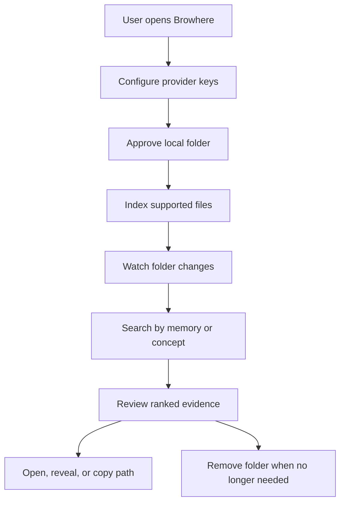
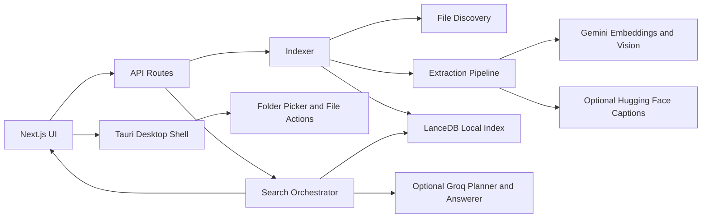

# Browhere

Browhere is a local-first semantic search app for personal folders. It indexes only the folders you approve, stores the searchable index on your machine, and lets you find files by meaning instead of exact filenames.

It is built as a Next.js app with a Tauri macOS shell, local LanceDB storage, Gemini embeddings, and optional Groq-assisted query planning and answer generation.

## Story Scenario

Maya is preparing a client update and remembers saving a PDF about budget risks, a screenshot of a menu board, and notes about launch concerns across different project folders. The filenames are vague, the screenshot has no useful filename, and Finder search only helps if she remembers exact words.

With Browhere, she approves the project folder once, waits for the local index to finish, then searches with phrases like `budget PDF from reports folder` or `what words are visible on the menu screenshot`. Browhere returns ranked local files with match context, evidence type, and desktop actions to open or reveal the file.

## Problem Statement

Desktop file search is still mostly literal. It works when you remember exact filenames, extensions, or text inside a document, but it breaks down when:

- the filename is vague, such as `IMG_4021.jpg` or `notes-final-v3.md`;
- the file is an image with no searchable text;
- the useful signal is inside a PDF or DOCX;
- the user remembers a concept, visual detail, topic, or folder context instead of a string;
- the user does not want to upload entire folder archives to a hosted search product.

Browhere addresses this by turning explicitly approved local folders into a semantic index while keeping the folder list, file records, metadata, and vector database local.

## Solution

Browhere discovers supported files under approved folders, extracts text and safe metadata, generates embeddings through Gemini, stores vectors in LanceDB, and returns ranked matches for natural-language searches.

For stronger retrieval, Browhere can use Groq as a bounded retrieval agent. Groq may rewrite a query into a small number of retrieval passes, rerank candidates, and generate cited answers, but it only receives the user query, candidate snippets, context-source labels, and selected safe metadata from already approved folders.

## Product Concept

Browhere is a private desktop search layer for people who work across messy local folders.

Key features:

- approve and remove local folders from the UI;
- recursively index `txt`, `md`, `pdf`, `docx`, `png`, `jpg`, and `jpeg` files;
- watch approved folders for additions, edits, and deletions;
- skip common sensitive or noisy paths such as `.env`, `.git`, `node_modules`, caches, build output, `*.key`, and `*.pem`;
- extract text from plain text, Markdown, PDF, and DOCX files;
- create image evidence through raw image embeddings, visual captions, OCR text, and safe metadata;
- search with semantic, lexical, metadata, OCR, and visual evidence signals;
- show readiness, provider status, indexed document logs, repair queue state, partial indexing, and failures;
- open, reveal, or copy result paths from the Tauri desktop app;
- use `CommandOrControl+Shift+Space` for a compact search window.

## User Flow



## System Architecture Flow



## Tech Stack

| Area | Technologies |
| --- | --- |
| Frontend | Next.js App Router, React 19, TypeScript |
| Desktop | Tauri 2, Rust, macOS app bundle, global shortcut plugin |
| Local Storage | LanceDB, local JSON metadata, app data directory |
| File Processing | Chokidar, pdf-parse, Mammoth, Node.js filesystem APIs |
| AI / APIs | Gemini embeddings and vision, optional Hugging Face image captions, optional Groq planning/reranking/answers |
| Validation | Zod |
| Testing | Vitest, Testing Library, Playwright |
| Packaging | Next standalone output, custom Tauri runtime packaging script |

## Smart Contracts

This project does not use smart contracts.

## Getting Started

Requirements:

- Node.js 20 or newer
- npm
- Rust toolchain for Tauri development and desktop builds
- Gemini API key for indexing and semantic search
- Groq API key only if you want agentic query planning, reranking, or answer generation

Install dependencies:

```bash
npm i
```

Create `.env.local` for web development:

```bash
GEMINI_API_KEY=your_gemini_key
GROQ_API_KEY=your_groq_key
HUGGINGFACE_API_KEY=your_huggingface_key
```

Gemini is required for embeddings. Groq and Hugging Face are optional.

## Environment Variables

No `.env.example` file is present. These variables were inferred from `lib/config.ts`, tests, and the Tauri launcher.

| Variable | Purpose |
| --- | --- |
| `GEMINI_API_KEY` | Enables Gemini embeddings, image embeddings, image labels, and OCR-related vision work. |
| `GROQ_API_KEY` | Enables optional Groq query planning, reranking, and answer generation. |
| `HUGGINGFACE_API_KEY` / `HF_TOKEN` | Enables Hugging Face image captioning when selected as the image-label provider. |
| `BROWHERE_INDEX_DIR` | Overrides the local index directory. Defaults to `.browhere/index` in web dev or the macOS app data index directory in desktop mode. |
| `BROWHERE_APP_DATA_DIR` | Set by the Tauri launcher for packaged desktop runtime data. |
| `BROWHERE_GEMINI_ENDPOINT` | Overrides the Gemini API endpoint. |
| `BROWHERE_GEMINI_EMBEDDING_MODEL` | Overrides the Gemini embedding model. Default: `gemini-embedding-2`. |
| `BROWHERE_GEMINI_VISION_MODEL` | Overrides the Gemini vision model. Default: `gemini-2.0-flash`. |
| `BROWHERE_GEMINI_EMBEDDING_DIMENSIONS` | Overrides embedding dimensions. Default: `3072`. |
| `BROWHERE_IMAGE_LABEL_PROVIDER` | Uses `gemini` by default; set to `huggingface` to use Hugging Face captions. |
| `BROWHERE_HUGGINGFACE_ENDPOINT` | Overrides the Hugging Face router endpoint. |
| `BROWHERE_HUGGINGFACE_IMAGE_CAPTION_MODEL` | Overrides the Hugging Face caption model. |
| `BROWHERE_GROQ_ENDPOINT` | Overrides the Groq chat completions endpoint. |
| `BROWHERE_GROQ_MODEL` | Overrides the Groq model. Default: `llama-3.3-70b-versatile`. |
| `BROWHERE_FINAL_RESULT_LIMIT` | Default returned result count. |
| `BROWHERE_MAX_FINAL_RESULT_LIMIT` | Maximum returned result count. |
| `BROWHERE_SEMANTIC_TOP_K` | Semantic candidate count. |
| `BROWHERE_MAX_SEMANTIC_TOP_K` | Maximum semantic candidate count. |
| `BROWHERE_LEXICAL_TOP_K` | Lexical candidate count. |
| `BROWHERE_MAX_LEXICAL_TOP_K` | Maximum lexical candidate count. |
| `BROWHERE_MAX_RETRIEVAL_PASSES` | Maximum retrieval passes for agentic search. Default: `2`. |
| `BROWHERE_ANSWER_CONTEXT_BUDGET` | Context budget for generated answers. |
| `BROWHERE_MAX_ANSWER_CONTEXT_BUDGET` | Maximum generated-answer context budget. |

Desktop settings can also be entered in the Tauri UI. The packaged app writes preferences and provider keys under the macOS app data directory; provider keys are separated from general preferences, but they are not yet stored in macOS Keychain.

## Running Locally

Run the web app:

```bash
npm run dev
```

Open `http://localhost:3000`.

Run the desktop app in development:

```bash
npm run tauri:dev
```

Build the web app:

```bash
npm run build
```

Build and install the macOS desktop app:

```bash
npm run tauri:build
npm run tauri:install-app
open /Applications/Browhere.app
```

The build command packages the Next standalone runtime into:

```text
src-tauri/target/release/bundle/macos/Browhere.app
```

The install command copies that bundle to:

```text
/Applications/Browhere.app
```

The current packaged launcher includes the Next standalone runtime assets in the app bundle, but it still requires a host `node` executable. Install Node.js before launching the packaged app on a clean machine. A fully bundled Node sidecar is still a packaging hardening task.

Useful scripts:

| Command | Purpose |
| --- | --- |
| `npm run dev` | Start the Next.js development server. |
| `npm run build` | Build the Next.js app for production. |
| `npm run start` | Start the production Next.js server. |
| `npm run tauri:dev` | Start the Tauri desktop app against the dev server. |
| `npm run tauri:build` | Build the macOS desktop release bundle and package the Next runtime. |
| `npm run tauri:install-app` | Copy the release bundle to `/Applications/Browhere.app`. |
| `npm run test` | Run Vitest tests. |
| `npm run test:e2e` | Run Playwright tests. |
| `npm run typecheck` | Run TypeScript checks. |

## Project Structure

```text
app/                         Next.js routes, UI, API handlers, and desktop bridge
app/api/folders/             Folder approval and removal API
app/api/index/status/        Index status API
app/api/search/              Search API
app/components/              Search and index panels
lib/ai/                      Gemini and Groq provider clients
lib/files/                   File discovery, exclusions, and extraction
lib/indexer/                 Folder watching, indexing, and repair queue
lib/search/                  Semantic, lexical, visual, metadata, and answer orchestration
lib/storage/                 LanceDB-backed repository and local metadata
src-tauri/                   Tauri desktop shell, macOS commands, packaging config
scripts/                     Runtime packaging utilities
docs/                        Desktop verification notes
openspec/                    Product specs and archived change history
test/                        Vitest setup
tests/                       Playwright tests
```

## Demo / Screenshots

For a visual, presentation-style version of the previous README, open [README.html](./README.html) in a browser.

Add current product screenshots or a hosted demo link here after deployment.

## API Surface

| Route | Method | Purpose |
| --- | --- | --- |
| `/api/folders` | `GET` | Return approved folders and runtime status. |
| `/api/folders` | `POST` | Approve and index a folder path. |
| `/api/folders` | `DELETE` | Remove an approved folder and exclude its records. |
| `/api/index/status` | `GET` | Return index state, provider readiness, counts, failures, repair queue state, and document log. |
| `/api/search` | `POST` | Search indexed files with a natural-language query. |

## Privacy Model

Browhere is local-first, not offline-only.

- The folder list, vector index, file records, extracted chunks, and metadata are stored locally in the configured index directory.
- Only folders explicitly approved in the UI are indexed.
- Default exclusions prevent common sensitive and generated paths from being indexed or sent to providers.
- Gemini receives indexed content or image data when embeddings, image labels, or OCR-related vision work is generated.
- Hugging Face receives image captioning payloads only when `BROWHERE_IMAGE_LABEL_PROVIDER=huggingface`.
- Groq receives bounded search payloads: the query, candidate snippets, context-source labels, and selected safe metadata.
- Groq does not receive full folder contents, non-candidate chunks, or files outside approved folders.

Use narrow test folders when working with private data.

## Testing

The test suite covers the main risks in a local Agentic RAG system: indexing the right evidence, retrieving the right chunks, keeping provider failures bounded, generating cited answers only from retrieved context, and keeping the UI usable.

| Test area | Files | What it assures |
| --- | --- | --- |
| File discovery and exclusions | `lib/files/discovery.test.ts`, `lib/files/exclusions.test.ts` | Supported files are discovered recursively while sensitive/noisy paths are skipped. |
| Text and document extraction | `lib/files/extraction.test.ts` | Plain text, Markdown, PDF, and DOCX extraction produce searchable chunks or partial-status fallbacks. |
| Index persistence and migration safety | `lib/storage/repository.test.ts` | Folders, files, chunks, metadata, evidence provenance, and vectors are persisted and normalized safely. |
| Image evidence indexing | `lib/indexer/indexer.test.ts` | Raw image vectors, visual captions, OCR text, metadata records, provider failures, and repair tasks can coexist. |
| Provider clients | `lib/ai/gemini.test.ts`, `lib/ai/groq.test.ts` | Gemini and Groq behavior handles success and missing-provider cases. |
| Retrieval quality fixtures | `lib/search/retrieval-eval.test.ts` | Representative queries return expected files, evidence sources, citation behavior, and insufficient-evidence behavior. |
| Search ranking and answer behavior | `lib/search/search.test.ts` | Hybrid scoring, query interpretation, source caps, fallback behavior, answer citations, and context budgeting work as expected. |
| UI behavior | `app/page.test.tsx`, `tests/rag-search.spec.ts` | Search controls, folder controls, result provenance, answer display, and browser rendering remain usable. |

Run local checks:

```bash
npm run test
npm run typecheck
```

Run browser tests:

```bash
npm run test:e2e
```

Playwright starts the development server automatically from `playwright.config.ts`. Run desktop verification before calling a Tauri build release-ready: [docs/desktop-verification.md](./docs/desktop-verification.md).

## Roadmap

- Bundle a Node sidecar so packaged desktop installs do not depend on a host Node.js executable.
- Move desktop provider secrets into macOS Keychain.
- Add signing, notarization, and auto-update for release distribution.
- Add more file types such as spreadsheets, audio, and video.
- Add richer screenshot/demo assets for judge or user-facing documentation.

## Notes

Browhere is currently a V1 local-first desktop/web app. It provides approved-folder indexing, semantic search, a Tauri desktop shell, a compact search window, native folder picking, and desktop open/reveal actions for approved indexed files. It does not provide user accounts, hosted sync, a remote vector database, Keychain-backed secret storage, a bundled Node sidecar, signing/notarization, or auto-update.
